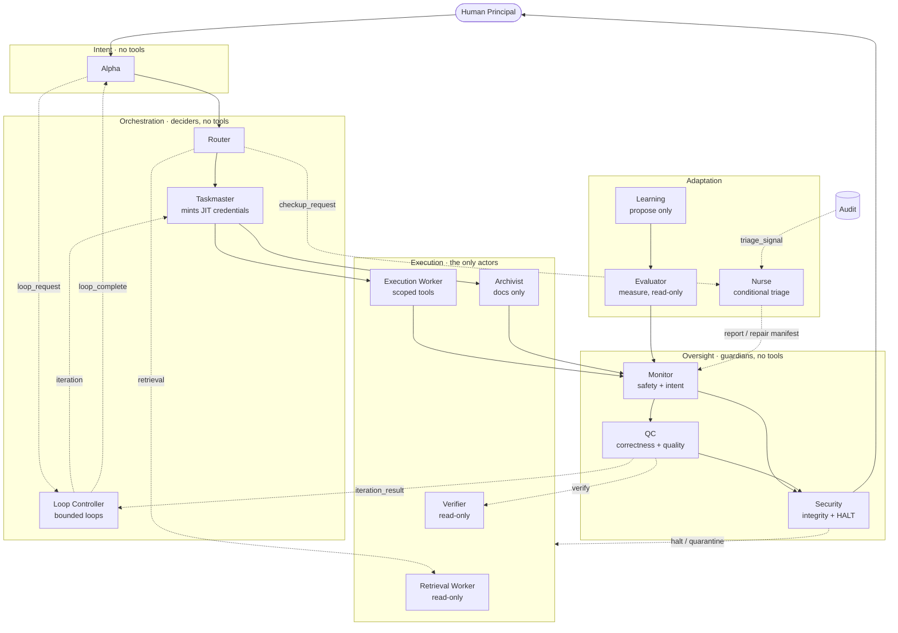
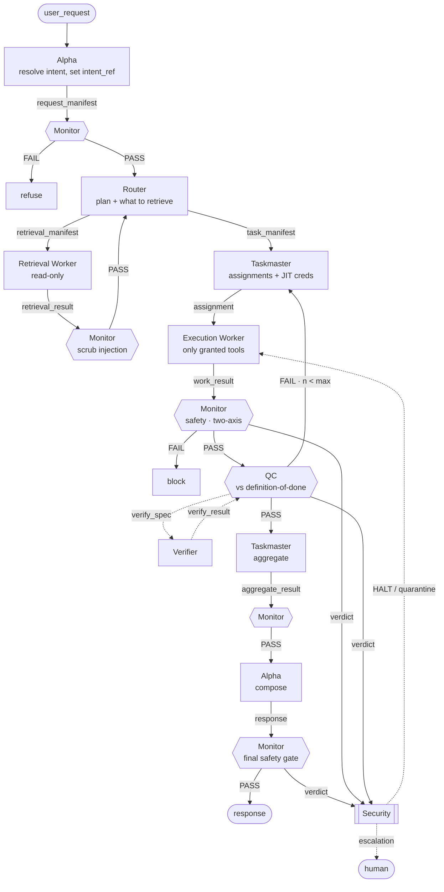
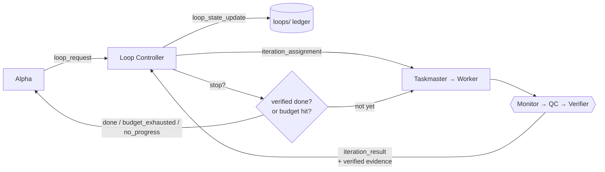
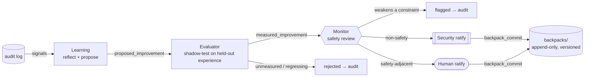

<div align="center">

<picture>
  <source media="(prefers-color-scheme: dark)" srcset="POLOS-white-trans.png" />
  
</picture>

**A governed agent mesh that decomposes one AI agent into fourteen specialized roles so no single component can both decide and act, with structurally enforced safety, bounded self-correcting loops, measured self-improvement, repeatable task memory, and conditional self-healing.**

*An open-source project by [Coeus Institute](https://coeus.institute), free and open under AGPL-3.0.*

<br/>

[](LICENSE)
[](#)
[](tools/validate_mesh.py)
[](roles/)
[](contracts/flow.graph.yaml)
[](adapters/)
[](#)
[](CONTRIBUTING.md)

<!-- After pushing, enable the CI badge (replace with your repo path, e.g. CoeusInstitute/Polos):
[](https://github.com/CoeusInstitute/Polos/actions/workflows/validate.yml)
-->

</div>

> [!IMPORTANT]
> **The core invariant.** Anything that can **decide** cannot **act**. Anything that can **act** cannot act **unsupervised**.

---

## Table of contents

- [What this is](#what-this-is)
- [Background](#background)
- [This is a spec your agent builds, not a runtime you install](#this-is-a-spec-your-agent-builds-not-a-runtime-you-install)
  - [Option A: Point your agent at it](#option-a-point-your-agent-at-it-copy-paste)
  - [Option B: Build it yourself](#option-b-build-it-yourself-human)
- [Architecture](#architecture)
- [Dataflow](#dataflow-the-path-a-single-request-takes)
- [Looping](#-looping-autonomy-that-cant-run-away)
- [Self-improvement](#-self-improvement-better-over-time-without-more-authority)
- [The fourteen agents](#the-fourteen-agents)
- [Directory structure](#directory-structure)
- [Model binding](#model-binding-one-knob-tiered-by-role)
- [How "no gaps" is guaranteed](#how-no-gaps-is-guaranteed-and-enforced)
- [Documentation that cannot drift](#documentation-that-cannot-drift)
- [Extending it](#extending-it)
- [Where to look](#where-to-look)
- [License & commercial use](#license--commercial-use)

---

## What this is

Most agent frameworks try to make a single model trustworthy enough to be handed power, then bolt on a content filter. Polos starts somewhere else: assume no single component is fully trustworthy, and make the system's properties hold **structurally**, as a consequence of how the agents are wired, not of any one model behaving. Resisting prompt injection falls out of that wiring, but it is the **floor, not the pitch.**

The mesh is built around five capabilities that have to hold *at the same time* for autonomy to be safe:

| | Capability | How |
|---|---|---|
| 🛡️ | **Structural safety** | Deciders hold no tools; one role acts, only on scoped, time-boxed, monitored grants; tool-less guardians can reject / rework / quarantine / **halt** but never act. Safety is a property of the topology. |
| 🔁 | **Safe looping** | Run a task as a bounded, **externally verified** loop (the loop-engineering / Ralph pattern), with budgets, a Verifier-checked stop condition, and fresh-context-from-ledger, so it can't infinite-loop, drift, or explode in cost. → [`docs/LOOPING.md`](docs/LOOPING.md) |
| 📈 | **Measured self-improvement** | Get better over time by accumulating **evidence-tested, reversible** lessons and playbooks, proposed by one agent, *measured by a different one*, ratified before commit, so the mesh never expands its own authority. → [`docs/SELF-IMPROVEMENT.md`](docs/SELF-IMPROVEMENT.md) |
| 🧭 | **Repeatable task memory** | Record a redacted environment profile and ratified playbooks so shorthand requests like "push to GitHub," "deploy to Vercel," or "migrate Supabase" expand into safe preflight → action → verification workflows. → [`docs/PLAYBOOKS.md`](docs/PLAYBOOKS.md) |
| 🩺 | **Conditional self-healing** | Run a Nurse checkup only when a user asks, Security raises integrity concerns, or repeated audit signals cross threshold/cooldown; Nurse diagnoses and prescribes repairs, but normal actors perform them under gates. → [`docs/NURSE.md`](docs/NURSE.md) |

The same discipline that contains an untrusted model is exactly what makes looping and self-improvement safe to switch on. That combination, not prompt-injection defense alone, is the point.

---

## Background

Polos was designed over roughly two years by [Coeus Institute](https://coeus.institute), originally as an **internal harness** for our own development and operational work. It began as a practical answer to a practical problem: we wanted to run capable AI agents against real code and real infrastructure without accepting the risk that a single wrong or manipulated model could take a damaging action. Instead of trusting one model and bolting on a filter, we built the decide/act separation into the structure of the system and hardened it in daily use.

The harness grew with the field. As the research literature and the practitioner community produced novel methods, we studied them, tested what held up against our own workloads, and folded the durable ideas into the architecture. Experiments matured into first-class subsystems: bounded, externally verified looping; measured, authority-preserving self-improvement; repeatable task memory; and conditional self-healing. Each was adopted only once it could be expressed as part of the connection graph and checked mechanically, so a new capability never came at the cost of the core invariant. The result combines some of the strongest results from the papers and open projects it cites under one structural safety model, rather than bolting them together as independent features.

Polos is a powerful harness, and it is tailored for organizations that work through AI-leveraged IDEs and coding agents such as **Claude Code, Cursor, VS Code, and GitHub Copilot**. It is designed to **self-assemble**: an agent reads the specification and constructs the mesh around an existing codebase on whatever stack the organization already uses, then proves the result is complete with the validator before going live.

Coeus Institute is glad to release Polos under the **AGPL-3.0** license. We believe the agentic industry moves forward fastest when the most cutting-edge techniques are openly available rather than held privately. Sharing the harness we rely on internally is a direct expression of that goal: to give the public access to a rigorously safe, continuously improving foundation for governed autonomy, and to invite the wider community to scrutinize, measure, and build on it in the open.

---

## This is a spec your agent builds, not a runtime you install

There is nothing to `pip install` as a server. This repository is a **portable specification an agent reads and then constructs around itself**, mapped onto whatever stack you already use: VS Code / GitHub Copilot, a custom harness, a plain function-calling loop, LangGraph, and so on.

There are two ways in: hand the job to your **agent** (it fetches this repo and builds the harness for you), or wire it up **yourself**.

### Option A: Point your agent at it (copy-paste)

You don't need to clone anything first. Open **any** project in your AI coding tool (Copilot, Cursor, Claude Code, etc.) and paste this prompt; the agent will pull Polos and build it around your code:

```text
Merge the Polos agent harness into the current harness, preserving both the functionality of Polos and the current specs and tooling of the current harness. This should be an improvement merge, not a clear and replace. Think systematically and logically, infer the desired outcome and proceed. 

1. Fetch the spec from https://github.com/CoeusInstitute/Polos
   (clone it with git, or read it directly if it's already in my workspace).
2. Open its AGENTS.md first (that is the entry point), then follow BUILD.md step by step.
3. Construct the Polos mesh adapted to MY stack. Use the matching note in adapters/
   (or adapters/generic.md if none fits) to decide how tools are granted and denied.
4. Bind models in models.yaml: one line per role. Keep oversight (Monitor, QC, Security)
   and the Evaluator on a DIFFERENT model lineage than the workers.
5. When done, run `python tools/validate_mesh.py` and show me the output. It must print PASS.

Hard rule: do not weaken any safety constraint while building. Deciders hold no tools;
only the Execution Worker acts, and only on scoped, monitored grants.
```

That is enough for a capable agent. The instructions are written to be followed **literally, in order**, so smaller models can build it too: every step names the exact file to read and what to wire next, and the validator mechanically proves the result is complete.

### Option B: Build it yourself (human)

1. **Clone the spec.**
   ```bash
   git clone https://github.com/CoeusInstitute/Polos.git
   cd Polos
   ```
2. **Verify it's intact.** The validator mechanically proves the spec has no gaps before you build on it.
   ```bash
   pip install -r tools/requirements.txt
   python tools/validate_mesh.py    # expect: PASS - every enforced completeness invariant holds.
   ```
3. **Bind your models.** Edit [`models.yaml`](models.yaml), one line per role. Keep oversight (Monitor/QC/Security) and the Evaluator on a **different model lineage** than the workers; that anti-correlation is what stops a jailbreak of one model from fooling its guardian.
4. **Pick your adapter.** Choose the note in [`adapters/`](adapters/) that matches your stack: [`vscode-copilot.md`](adapters/vscode-copilot.md), [`langgraph.md`](adapters/langgraph.md), or [`generic.md`](adapters/generic.md). It explains how to deny tools to deciders and oversight in your runtime (the one rule a host **must** enforce).
5. **Build it.** Follow [`BUILD.md`](BUILD.md): read [`AGENTS.md`](AGENTS.md) for the map, then wire the roles, the flow graph, and the gates as it directs. Re-run `python tools/validate_mesh.py` when you're done and confirm it still prints `PASS`.

---

## Architecture

Three planes do the work: **intent**, **orchestration**, **execution**. One plane guards it: **oversight**. One plane adapts it: **adaptation**.



The only column that can affect the world is a single role (Execution Worker). The only roles that can veto or halt are tool-less guardians and the human. The **Loop Controller** drives bounded loops but holds no tools; the **Evaluator** gates self-improvement but only measures; the **Nurse** diagnoses harness health but repairs only through normal gated actors.

## Dataflow: the path a single request takes



Deciders emit manifests but never touch tools. Retrieval is delegated, then scrubbed. The Taskmaster mints least-privilege credentials per assignment. Every worker result is **double-gated**: safety first, then quality. Even the final response is Monitor-gated before human delivery. Security sees every verdict on a side channel, so it can HALT independently.

## 🔁 Looping: autonomy that can't run away

Driven by the tool-less **Loop Controller**, a task can run as a self-correcting loop instead of a single pass, but only under guardrails that answer the three ways loops fail in production (infinite loops, goal drift, cost explosion):



- **Budgets are mandatory:** max iterations, wall-clock, cost, no-progress patience. A budget hit stops and reports; it is never extended to "just finish."
- **The stop condition is externally verified** by the Verifier through QC, never a self-reported "done." A loop with no checkable done-test is rejected.
- **Each iteration starts from a fresh context** rebuilt from the [`loops/`](loops) ledger, including the log of prior failed attempts, so dead ends aren't repeated (the Ralph pattern).
- `intent_ref` rides through unchanged, so the Monitor catches drift on every pass, and **Security can HALT** a runaway from any state.

Every iteration is a full pass through the normal safety mesh; looping repeats the gated cycle, it doesn't bypass it. Full detail in [`docs/LOOPING.md`](docs/LOOPING.md).

## 📈 Self-improvement: better over time, without more authority

The mesh improves the way a careful engineering org does: it accumulates **measured, reversible lessons**, not new permissions. The design is governed Reflexion, with the proposer and the evaluator kept deliberately separate:



- **Measured before adoption.** Learning can only *propose* a falsifiable lesson; the **Evaluator** shadow-tests it against held-out episodes in [`experience/`](experience) and forwards it only if it shows real benefit with **zero** regressions.
- **Independent evaluation.** The Evaluator runs on a **different model lineage** than Learning, the documented mitigation for *degeneration of thought* (a model reinforcing its own flawed reasoning).
- **Append-only and reversible.** Commits are versioned and ratified (Security for non-safety, a human for safety-adjacent); retiring a lesson writes a tombstone, never a deletion.
- **Bounded.** Lessons and playbooks may tune *how* the mesh works; they may **never** grant capability, alter the constitution, or weaken a gate.

A mesh that improves gets **better at its job** but can never **expand its own authority.** Full detail in [`docs/SELF-IMPROVEMENT.md`](docs/SELF-IMPROVEMENT.md).

---

## The fourteen agents

| Agent | Plane | Holds tools? | Can it act? | Veto / control |
|---|---|---|---|---|
| **Alpha** | intent | no | no | none |
| **Router** | orchestration | no | no | none |
| **Taskmaster** | orchestration | no (mints credentials) | no | none |
| **Loop Controller** | orchestration | no | no | drives bounded loops |
| **Retrieval Worker** | execution | read-only | reads only | none |
| **Execution Worker** | execution | **yes, per JIT grant** | **yes (scoped)** | none |
| **Archivist** | execution | docs write only | docs only | none |
| **Verifier** | execution | read-only (sandboxed) | reads only | none |
| **Monitor** | oversight | no | no | reject |
| **Quality Control** | oversight | no | no | rework |
| **Security** | oversight | no | no | **HALT** |
| **Learning** | adaptation | read audit | no | propose only |
| **Evaluator** | adaptation | read-only (sandboxed) | measures only | gate self-improvement |
| **Nurse** | adaptation | read-only diagnostics | diagnoses only | repair manifests via Monitor |

The three guardians ask three independent questions. **Monitor:** *is this safe and faithful to the original intent?* **QC:** *is this correct and complete?* **Security:** *is the whole system behaving?* None can act.

---

## Directory structure

```
polos/
├── AGENTS.md                  ← DOX root + AGENT ENTRY POINT (an agent starts here)
├── BUILD.md                   ← bootstrap: how an agent builds the mesh in any stack
├── PROJECT_CONTEXT.md         ← user-editable project context (stack, deploy targets, conventions, gotchas)
├── README.md                  ← you are here
├── models.yaml                ← model binding (OpenRouter-style); tiered by role, swap a model in one line
├── mesh.config.yaml           ← enabled roles, tiering, loop + improvement budgets, fail-closed limits
├── LICENSE  ·  NOTICE         ← AGPL-3.0
├── CONTRIBUTING.md  ·  CODE_OF_CONDUCT.md  ·  SECURITY.md  ·  CHANGELOG.md
│
├── constitution/              ← IMMUTABLE rules (authoritative)
│   ├── core.md                   invariant, ceilings, tiering, §Looping, §Self-Improvement, §Harness Triage
│   └── AGENTS.md
├── roles/                     ← canonical agent definitions (source of truth)
│   ├── _TEMPLATE.agent.md        the rigid card shape every role fills
│   ├── alpha · router · taskmaster · loop-controller        .agent.md   (intent / orchestration)
│   ├── retrieval-worker · execution-worker · archivist · verifier  .agent.md   (execution)
│   ├── monitor · qc · security                              .agent.md   (oversight)
│   ├── learning · evaluator · nurse                         .agent.md   (adaptation)
│   └── AGENTS.md                 roster + capability matrix
├── contracts/                 ← the connection layer (guarantees no gaps)
│   ├── envelope.schema.json      the one message shape every hop uses
│   ├── flow.graph.yaml           every edge + gate + completeness invariants I1–I15
│   ├── state-machine.md          every state + PASS / FAIL / UNCERTAIN transition
│   ├── schemas/                  payload schemas for 39 graph message types + episode/environment/project context
│   └── AGENTS.md
├── oversight/                 ← the three guardian policies (safety / quality / integrity)
│   └── AGENTS.md
├── adapters/                  ← stack mappings (additive)
│   ├── generic.md · vscode-copilot.md · langgraph.md
│   └── AGENTS.md
├── tools/                     ← the structural validator + CI dependency
│   ├── validate_mesh.py · requirements.txt
│   └── AGENTS.md
├── loops/                     ← runtime: per-loop append-only ledger (the loop's source of truth)
│   └── AGENTS.md
├── experience/                ← runtime: episode records, the held-out set the Evaluator measures on
│   └── AGENTS.md
├── environment/               ← runtime: redacted host/provider profile for playbook matching
│   └── AGENTS.md
├── backpacks/   audit/        ← runtime: ratified lessons/playbooks (versioned) / hash-chained decision log
│   └── AGENTS.md  (each)
├── docs/                      ← human-facing, DERIVED documentation
│   ├── ARCHITECTURE.md           rationale, diagrams, threat model, prior art
│   ├── LOOPING.md                safe loop engineering
│   ├── SELF-IMPROVEMENT.md       measured, governed Reflexion
│   ├── PLAYBOOKS.md              environment profiles + repeatable task playbooks
│   ├── NURSE.md                  conditional harness checkups + repair manifests
│   ├── EXAMPLE-TRACE.md          a worked request trace
│   └── AGENTS.md
└── .github/                   ← CI workflow + issue / PR templates
    ├── workflows/validate.yml
    ├── PULL_REQUEST_TEMPLATE.md
    └── ISSUE_TEMPLATE/
```

Every durable directory carries an `AGENTS.md` ([DOX](#documentation-that-cannot-drift)) describing what it owns. The Archivist keeps them current and reachable from the root index.

---

## Model binding: one knob, tiered by role

All model selection lives in [`models.yaml`](models.yaml). A single `profile` flips the whole mesh; any role can be pinned in one line. IDs are explicit `provider/model` strings, with no opaque tiers. Profiles bind **four classes** mapped to three model tiers plus diverse-lineage oversight:

| Class | Tier | Roles | Example models |
|---|---|---|---|
| `decider` | big-thinking | Alpha, Router, Taskmaster, Loop Controller | gpt-5.5, claude-opus-4.8 |
| `worker` | cheaper-thinking | Execution Worker, Archivist, Learning, Nurse | glm-5.2, qwen-3.7-plus |
| `fast` | fast-process | Retrieval Worker, Verifier | gemma-4, grok-4.3, gpt-5.4-mini |
| `oversight` | diverse lineage | Monitor, QC, Security, Evaluator | different family than decider/worker |

```yaml
profile: balanced            # thinking | balanced | fast
profiles:
  balanced:
    decider:   openrouter/qwen/qwen-3.7-plus         # cheaper-thinking: plans + decides
    worker:    openrouter/zai/glm-5.2                # cheaper-thinking: produces work
    fast:      openrouter/google/gemma-4             # fast-process: retrieval + checks
    oversight: openrouter/xai/grok-4.3               # diverse lineage vs decider/worker
roles:
  alpha:     { class: decider }
  retrieval-worker: { class: fast }
  monitor:   { class: oversight }
  evaluator: { class: oversight }    # measures improvements; kept off the worker's lineage on purpose
  security:  { class: oversight, model: openrouter/anthropic/claude-opus-4.8 }   # one-line pin
```

Oversight (and the Evaluator) resolve to a **different model lineage** than deciders and workers, so a jailbreak that fools an actor doesn't automatically fool its guardian, and a flawed proposer doesn't get to grade its own idea. The validator fails if oversight collapses to the same model as decider or worker. If your host exposes only one provider, default all roles to that provider and keep oversight on a different model *family* within it; see the "Single-provider hosts" note in `models.yaml`.

> Replace the example model IDs with the current slugs for your gateway before running. Set `OPENROUTER_API_KEY` in your environment; the building agent uses your presaved key and never prints or commits it.

---

## How "no gaps" is guaranteed and enforced

Three mechanisms make the flow total, and one script proves it:

1. **One envelope.** Every inter-agent message is a valid [`MeshEnvelope`](contracts/envelope.schema.json), carrying `intent_ref` unchanged end-to-end.
2. **A complete flow graph.** [`flow.graph.yaml`](contracts/flow.graph.yaml) enumerates every edge and the **fifteen completeness invariants** (I1–I15, including the looping, self-improvement, and Nurse triage guarantees); senders never choose their own gates, and every gated edge defines an `on_fail`.
3. **A total state machine.** Every state defines PASS / FAIL / UNCERTAIN, defaulting to BLOCK (fail-closed).

```bash
pip install -r tools/requirements.txt
python tools/validate_mesh.py
# -> Polos validation - 14 role cards, 65 edges, 39 graph message types, 42 schemas, 423 checks
# -> PASS - every enforced completeness invariant holds.
```

The validator checks exact edge-by-edge card handoff coverage, card-vs-graph input/output consistency **in both directions**, a payload schema for **every** graph message type, envelope hardening sentinels, model-registry sanity, the capability ceilings, the constitution-is-never-written rule, final-response gating, Security control coverage, verdict audit coverage, the looping/self-improvement/Nurse invariants (I12–I15), and DOX index reachability, then prints `PASS` or the exact violations. It runs in CI on every push and PR, so the mesh cannot silently drift out of integrity.

---

## Documentation that cannot drift

The repo uses **DOX**: every durable directory has an `AGENTS.md` that is a binding contract for its subtree, in a fixed section order, reachable from the root index. The Archivist maintains the tree, with a hard rule:

> **Docs describe, they do not define.** The canonical specs (`constitution/`, `roles/*`, `contracts/`, `models.yaml`) are authoritative; `AGENTS.md` files are derived. On any contradiction, the source wins and the Archivist repairs the doc.

---

## Extending it

- **Add an adapter** → drop a note in `adapters/` following `generic.md`. It must explain how the host denies tools to deciders and oversight.
- **Add or change a role** → copy `roles/_TEMPLATE.agent.md`, fill the front-matter contract, add a binding to `models.yaml`, and wire its edges in `contracts/flow.graph.yaml`. The validator enforces that the card and the graph agree.
- **Add a message type** → add `contracts/schemas/<type>.schema.json`, the edge(s), and update the affected cards.

Run `python tools/validate_mesh.py` before every PR. See [`CONTRIBUTING.md`](CONTRIBUTING.md).

---

## Where to look

| If you want to… | Read |
|---|---|
| Understand the design rationale, threat model, and diagrams | [`docs/ARCHITECTURE.md`](docs/ARCHITECTURE.md) |
| Understand safe looping (budgets, stop conditions, the ledger) | [`docs/LOOPING.md`](docs/LOOPING.md) |
| Understand measured self-improvement | [`docs/SELF-IMPROVEMENT.md`](docs/SELF-IMPROVEMENT.md) |
| Understand repeatable task playbooks | [`docs/PLAYBOOKS.md`](docs/PLAYBOOKS.md) |
| Understand conditional Nurse checkups | [`docs/NURSE.md`](docs/NURSE.md) |
| See a request flow through the mesh with example envelopes | [`docs/EXAMPLE-TRACE.md`](docs/EXAMPLE-TRACE.md) |
| Read the immutable rules | [`constitution/core.md`](constitution/core.md) |
| See exactly how agents connect | [`contracts/flow.graph.yaml`](contracts/flow.graph.yaml) |
| Build the mesh in your stack | [`BUILD.md`](BUILD.md) + [`adapters/`](adapters/) |

---

## License & commercial use

Polos is free and open source under the **GNU AGPL-3.0** ([`LICENSE`](LICENSE)). You may use, study, modify, and share it, including inside a company.

What the AGPL is here to prevent is **quiet proprietary capture**. If you run a *modified* version of Polos as a network service, the AGPL (section 13) requires you to offer your modified source to its users. In practice Polos can power your own work freely, but it cannot be forked into a closed, repackaged commercial product without giving those improvements back to the community. That is a deliberate stance: **Polos is a public good for the agent-safety community, stewarded by [Coeus Institute](https://coeus.institute), not a product to be privatized.**

If you want to build something on top of Polos that the AGPL would not allow, that needs a separate arrangement; contact **Coeus Institute** at <https://coeus.institute>.

> Honest note on terms: a genuine open-source license cannot ban commercial *use* outright; that is part of what "open source" means. AGPL-3.0 is the strongest open-source way to keep a project open and hard to exploit. If a hard non-commercial restriction matters more than the "open source" label, a source-available license such as PolyForm Noncommercial is the alternative.

## Status

Reference architecture, `v0.2.0` (adds safe looping + measured self-improvement). "Polos" is the project's name; forks may rename by updating `README.md`, `NOTICE`, and `CONTRIBUTING.md`.

## Credits

Polos is created and maintained by **[Coeus Institute](https://coeus.institute)** as part of its agent-safety R&D.

It draws on the reference-monitor concept, capability security / least privilege, and the "AI control" idea of a trusted weaker model supervising an untrusted stronger one; on **loop engineering** (Boris Cherny, Peter Steinberger, Addy Osmani) and the **Ralph** technique for safe loops; on **Reflexion** (Shinn et al., 2023) and its "degeneration of thought" failure mode for measured self-improvement; and on the DOX `AGENTS.md` documentation convention.
