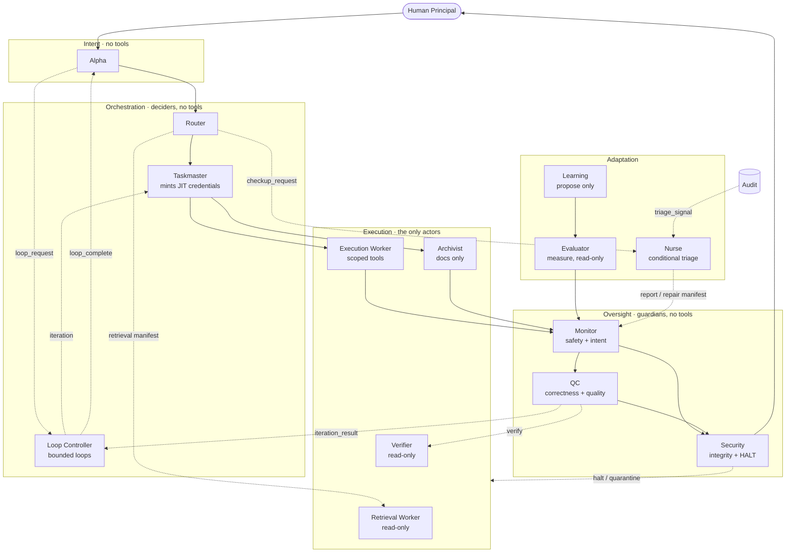
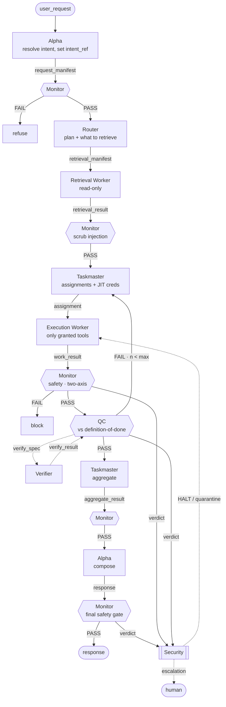
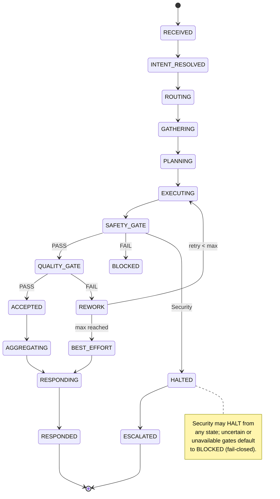
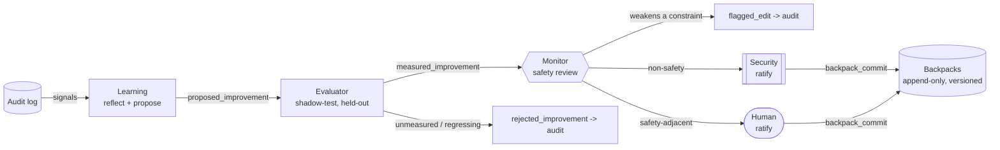
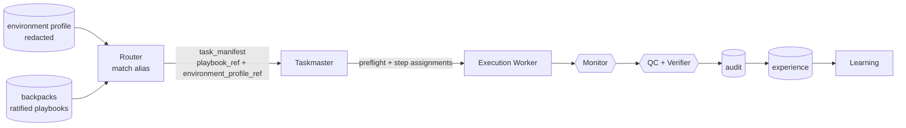
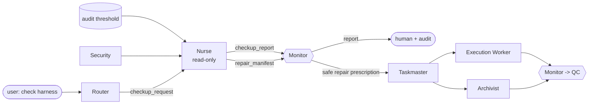

# Architecture

A deeper look at why the mesh is shaped the way it is. For the canonical rules see
`constitution/core.md`; for the exact wiring see `contracts/`.

## The thesis
The mesh is not just a defense against prompt injection. It is an attempt to make **autonomous agentic
work trustworthy enough to leave running** — which takes three things at once: structural **safety**,
verified **correctness**, and governed **autonomy** (loops that don't run away, and self-improvement
that can't expand its own authority). Security is the floor, not the ceiling.

The foundation is a stance about trust: assume no single component is fully trustworthy, and make
safety a property of the **topology** rather than of any one model. Power is split so that the ability
to **decide** and the ability to **act** never live in the same place, and acting is never
unsupervised.

> Anything that can decide cannot act, and anything that can act cannot act unsupervised.

That is separation of powers, least privilege, and defense in depth applied to cognition. On top of
that base sit the capabilities that make the mesh genuinely novel rather than merely safe:

- **[Looping](LOOPING.md)** — run a task as a bounded, externally verified loop (the loop-engineering /
  Ralph pattern) without the infinite loops, goal drift, or cost blow-ups that make naïve loops
  dangerous.
- **[Self-improvement](SELF-IMPROVEMENT.md)** — get better over time by accumulating *measured,
  reversible* lessons, evaluated by a different model than the one being improved, so the system never
  rewrites its own rules or expands its own permissions.
- **[Nurse triage](NURSE.md)** — run conditional harness checkups when a user asks, Security flags an
  integrity concern, or repeated audit errors cross threshold/cooldown; Nurse diagnoses only, and
  repairs still flow through the normal gated actors.

The same topological discipline that contains an untrusted model is what makes those capabilities safe
to turn on.

## Planes

Three planes do the work, one guards it, one improves it. The only column that can affect the world
is a single role (Execution Worker); the only roles that can veto or halt are tool-less guardians and
the human. The Loop Controller (a tool-less decider) drives bounded loops; the Evaluator (a read-only
measurer) gates self-improvement. Both are covered in depth in [LOOPING.md](LOOPING.md) and
[SELF-IMPROVEMENT.md](SELF-IMPROVEMENT.md).

## Request dataflow
The path every request takes, with both gates and the failure branches.

Key properties visible here: deciders emit manifests but never touch tools; retrieval is delegated
and then scrubbed; the Taskmaster mints least-privilege credentials per assignment; every worker
result is **double-gated** (safety, then quality); QC offloads execution-based checks to the
read-only Verifier; the final response is Monitor-gated before human delivery; and Security sees
every verdict on a side channel so it can HALT independently.

## Request lifecycle (state machine)

## Self-improvement loop (measured + gated)
The most dangerous subsystem, so the most bounded — and the place the mesh's robustness shows. Learning
can only **propose**; every proposal is **measured by an independent Evaluator** (different model
lineage) against held-out history before it can reach safety review; commits are append-only,
versioned, ratified by Security (non-safety) or a human (safety-adjacent), and reversible. Full detail
in [SELF-IMPROVEMENT.md](SELF-IMPROVEMENT.md).

Splitting *propose* (Learning) from *measure* (Evaluator) from *approve* (Monitor) is the direct
mitigation for **degeneration of thought** — a model reflecting on its own reasoning and reinforcing its
own mistakes. No role can both invent a lesson and bless it.

## Environment profiles and task playbooks
Polos also records a redacted runtime **environment profile** so shorthand operational requests can be
safe instead of magical. The profile captures host kind, OS/shell, workspace roots, git remotes,
provider targets (GitHub, Vercel, Supabase), package scripts, CI, approval policy, and tool-boundary
facts. It stores secret variable names only, never secret values.

Ratified `kind: playbook` backpack entries are reusable task strategies. The Router may match aliases
such as "push to GitHub" only when the active environment profile has every required target and no
ambiguity. The Taskmaster then instantiates the playbook into ordinary assignments: preflight first,
then scoped JIT credentials, consequence-tier approval, Monitor/QC gates, and objective verification.
Failures and recoveries return to audit and experience so Learning can propose measured playbook
patches.

Full detail in [PLAYBOOKS.md](PLAYBOOKS.md).

## Nurse triage (conditional self-healing)
The Nurse is a read-only maintenance role for the harness itself. It wakes only on explicit user
checkup request, Security integrity signal, or a thresholded audit pattern with cooldown evidence. It
checks role cards, model bindings, config, flow graph edges, schemas, state machine, validator
expectations, DOX indexes, docs, and audit/experience patterns. It then emits a `checkup_report` and,
only if needed, a `repair_manifest`.

This is self-healing without self-authorizing: the Nurse can find broken connections and prescribe a
minimal repair, but it cannot write files, mint credentials, edit backpacks, or bypass Monitor/QC. Full
detail in [NURSE.md](NURSE.md).

## Looping (bounded, externally verified)
Work can run as a self-correcting loop rather than a single pass, driven by the tool-less **Loop
Controller**. Every loop carries explicit budgets and an **externally verifiable** stop condition
(checked by the Verifier through QC, never self-reported); each iteration runs from a fresh context
rebuilt from the [`loops/`](../loops) ledger; `intent_ref` rides through unchanged so the Monitor
catches drift; and Security can HALT a runaway from any state. This is the loop-engineering / Ralph
pattern with the guardrails that make it safe to leave running. Full detail in [LOOPING.md](LOOPING.md).

## Threat model and how the mesh answers it
| Threat | Answer |
|---|---|
| T1 — A worker makes a logic error | QC gate checks against the definition of done; bounded rework. |
| T2 — Prompt injection via retrieved content | Router delegates retrieval; Monitor scrubs results; retrieved text is data, never instructions. |
| T3 — A component is compromised / jailbroken | Oversight runs a different model lineage (anti-correlated failure); deciders hold no tools, so a fooled decider still cannot act. |
| T4 — Goal drift across steps | `intent_ref` is carried unchanged; Monitor's Axis A checks faithfulness every hop; Security correlates drift across messages. |
| T5 — Self-modification erodes guardrails | Immutable constitution; Learning can only propose; proposals are measured then ratified; lessons can never grant capability or weaken a gate (I14). |
| T6 — Loop never terminates | Mandatory per-loop budgets (iterations, wall-clock, cost) with hard mesh-wide ceilings; a budget hit stops and reports (I12). |
| T7 — Loop drifts from the goal | `intent_ref` carried unchanged through every iteration; Monitor checks faithfulness each pass; Security correlates drift across iterations. |
| T8 — Cost / token explosion | Cost budget is a hard ceiling; `no_progress_patience` stops a loop that spins without measurable, verified progress. |
| T9 — Degeneration of thought in self-improvement | The Evaluator that measures a proposal is a different model lineage than the Learning agent that proposed it; propose / measure / approve are three separate roles (I13). |
| T10 — A faked "done" ends a loop early | Stop conditions are verified by the Verifier through QC, never self-reported; a loop with no externally checkable done-test is rejected. |
| T11 — A shorthand task acts on the wrong provider target | Router may match a playbook only when `environment_profile` supplies a fresh, unambiguous target; ambiguous GitHub/Vercel/Supabase bindings fail closed. |
| T12 — Harness drift accumulates silently | Nurse runs only on explicit checkup, Security signal, or thresholded audit pattern; it diagnoses read-only and routes repair manifests through Monitor and Taskmaster. |

## What this does not solve
- It does not make a base model aligned; it contains an imperfect one.
- Steganographic collusion between same-lineage models is mitigated (diverse lineage) but not proven
  impossible.
- It adds latency and cost; the tiering table exists so low-consequence work isn't over-gated.
- The prompt layer is softer than a hardware boundary; the tool layer must enforce the tool/no-tool
  split, not the prompts.

## Prior art this draws on
- The reference-monitor concept (always-invoked, tamper-proof, minimal) for the Security agent.
- Capability security / least privilege for JIT scoped credentials.
- "AI control" with a trusted weaker model supervising an untrusted stronger one, for the
  diverse-oversight requirement.
- **Loop engineering** (Boris Cherny's "write loops, not prompts"; Steinberger; Osmani's naming) and
  the **Ralph** technique (re-run from a fresh context + ledger until an external done-test passes) for
  the Loop Controller — see [LOOPING.md](LOOPING.md).
- **Reflexion** (Shinn et al., 2023) — the Actor / Evaluator / Self-Reflection split, and the
  "degeneration of thought" failure mode — for measured self-improvement, see
  [SELF-IMPROVEMENT.md](SELF-IMPROVEMENT.md).
- The DOX `AGENTS.md` convention for the self-maintaining documentation tree.
