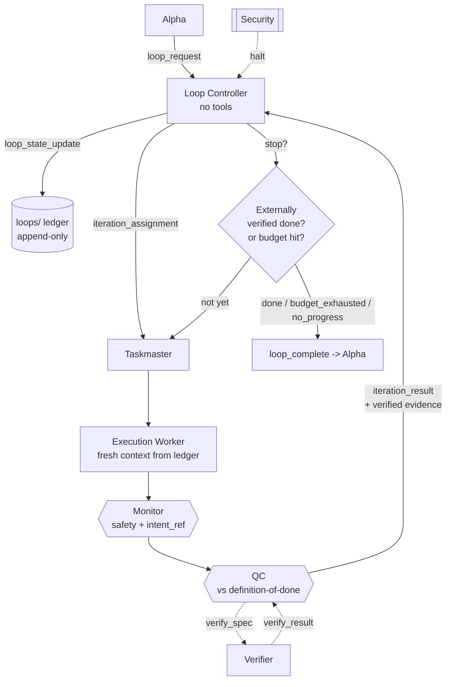

# Looping — Safe Loop Engineering

One of the two capabilities that make this mesh more than a security wrapper. (The other is
[measured self-improvement](SELF-IMPROVEMENT.md).)

## What loop engineering is
Through 2025–2026 the unit of agentic work moved from the keystroke, to the prompt, to the **loop**.
Boris Cherny, who built Claude Code, described his own job as no longer prompting the model at all but
writing loops that prompt the model and decide what to do next. Peter Steinberger and Addy Osmani
(who named the practice "loop engineering") made the same point: you stop being the thing that
prompts, and instead design a small control system that runs an agent until a goal is met.

An agentic loop, reduced to its essence, is **a trigger plus a verifiable goal**: the agent perceives,
reasons, plans, acts, observes, and repeats until the goal is verified or a stop condition fires. The
lineage runs from ReAct (2022) through the "Ralph" technique — re-running a task from a *fresh
context* plus an updated ledger until an externally checkable done-test passes — to the loop primitives
now shared across Claude Code and OpenAI Codex.

## Why naïve loops are dangerous
The practitioner literature is blunt that loops fail in production, and not as edge cases. The three
recurring failure modes are:

1. **Infinite loops** — the agent never recognizes completion and runs forever.
2. **Goal drift** — across iterations the objective quietly mutates into something the user never asked
   for.
3. **Cost / token explosion** — an unbounded loop burns budget without bound.

A fourth, subtler one: **trusting a self-reported "done."** A model that grades its own completion will
declare victory it has not earned. Loop engineering's hard-won lesson is that **verification is the
whole game** — the stop condition must be external and objective.

## How the mesh makes loops safe
Looping is run by a dedicated role, the **Loop Controller**, under guardrails written into the
[constitution](../constitution/core.md) (§Looping) and enforced by invariant **I12**. The Loop
Controller is a *decider*: it chooses what the next iteration is, when to stop, and when to give up —
and, like every decider in the mesh, **it holds no tools and never touches the world.**

Each failure mode above has a structural answer:

| Failure mode | The mesh's answer |
|---|---|
| Infinite loop | Every loop declares explicit **budgets** — `max_iterations`, `max_wall_clock_seconds`, `max_cost_usd`, `no_progress_patience`. A budget hit **stops and reports**; budgets are never extended to "just finish." |
| Trusting a fake "done" | The **stop condition is verified by the Verifier through QC**, never self-reported by the worker. A loop with no Verifier-checkable done-test is rejected outright (`require_external_stop_condition`). |
| Goal drift | `intent_ref` is carried unchanged through every iteration, so the **Monitor checks faithfulness on each pass** and Security can correlate drift across iterations. |
| Cost explosion | The cost budget is a hard ceiling; `no_progress_patience` stops a loop that is spinning without measurable progress. |
| Repeating dead ends | Each iteration runs from a **fresh context rebuilt from the external loop ledger** in [`loops/`](../loops), including the append-only log of what previous iterations tried and why they failed. |
| Runaway | **Security can HALT** a loop from any state; the system is **fail-closed** — a loop that cannot verify progress stops. |

The key design move is that the intelligence does not live in an ever-growing chat history; it lives in
**the spec, the externally verifiable stop condition, and the ledger.** That is what lets each
iteration start clean (the Ralph pattern) without losing the thread — and what keeps a long autonomous
run from drifting or ballooning.

## The loop, as wired

Each iteration is a *full pass through the normal safety mesh* — Monitor then QC then Verifier. Looping
does not bypass any gate; it repeats the gated cycle until an external check says the goal is met.

## Message vocabulary
| Message | From → To | Meaning |
|---|---|---|
| `loop_request` | Alpha → Loop Controller | Run this objective as a bounded loop; carries the spec, the external `stop_condition`, and `budgets`. |
| `iteration_assignment` | Loop Controller → Taskmaster | The single next increment, a fresh-context flag, and the `ledger_ref`. |
| `iteration_result` | QC → Loop Controller | The iteration's outcome with the Verifier's objective evidence. |
| `loop_state_update` | Loop Controller → `loops/` | Append the iteration (goal, changes, failures, verified result) to the external ledger. |
| `loop_complete` | Loop Controller → Alpha | The loop ended; `status` ∈ {`done`, `budget_exhausted`, `no_progress`, `halted`}, with a summary and `ledger_ref`. |

`loop_complete.status` is never `done` unless the Verifier confirmed it. On `budget_exhausted` or
`no_progress`, the Loop Controller returns the best *verified* state with an explicit caveat — it never
claims success the Verifier did not confirm.

## Worked example
**Request:** *"Get the test suite green."*

1. Alpha → `loop_request`: stop condition = "all tests pass" (Verifier-checkable); budgets = 25
   iterations / 1h / \$25 / patience 3.
2. Iteration 1: worker fixes a failing test; QC + Verifier confirm 3 of 12 still fail →
   `iteration_result{passed:false, progress_metric: 9/12}`. Ledger updated.
3. Iterations 2–4: each starts fresh from the ledger (so it doesn't re-try the fixes already logged as
   failures), chips away; progress metric climbs.
4. Iteration 5: Verifier confirms 12/12 pass → `iteration_result{passed:true}` →
   `loop_complete{status: done}` → Alpha responds.

Had the suite stalled at 11/12 for three iterations, the loop would stop with
`status: no_progress` and report the best verified state plus a caveat — not a false "done."

## Configuration
Mesh-wide ceilings live in [`mesh.config.yaml`](../mesh.config.yaml) under `limits.loop`; a per-request
budget may be stricter but never looser. Set `roles_enabled.loop-controller: false` to disable looped
execution entirely and run every task single-pass.
