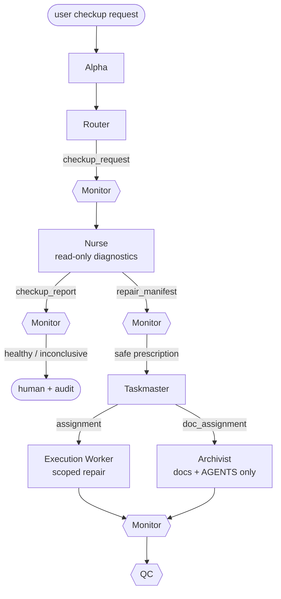
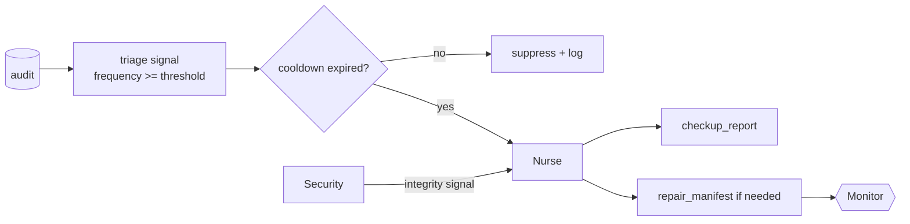

# Nurse — Conditional Harness Triage

The Nurse is Polos's self-healing checkup role. It exists for the moment when the harness itself may
have drifted: a broken connection, stale docs, missing schema, mismatched model binding, repeated
validator failure, stale count, or a pattern of runtime errors that points back to the harness rather
than the user's task.

The Nurse is deliberately conditional. It is not a background tax on every request.

> The Nurse diagnoses and prescribes. It does not repair directly.

## When Nurse runs

The Nurse may run only from one of three triggers:

| Trigger | Example | Guardrail |
|---|---|---|
| Explicit user request | "Run a harness checkup" or "something is broken" | Router emits a bounded `checkup_request`. |
| Security integrity concern | repeated suspicious gate failures | Security emits a `triage_signal` with evidence. |
| Audit threshold | same structural failure repeats across traces | Runtime emits a `triage_signal` only after threshold and cooldown checks. |

A single ordinary task failure does not wake the Nurse. Automatic triage requires repeated evidence,
a configured threshold, and a cooldown reference so the same unresolved issue does not trigger a new
checkup over and over.

Configuration lives in [`mesh.config.yaml`](../mesh.config.yaml):

```yaml
limits:
  nurse:
    min_error_signal_count: 3
    cooldown_seconds: 3600
    max_checkup_depth: full
    require_user_or_security_trigger: true
    auto_repair_consequence_ceiling: docs
```

## What Nurse checks

A checkup can inspect the harness's connection logic and derived surfaces through read-only diagnostics:

- role cards and front matter in `roles/`
- model bindings in `models.yaml`
- role enablement and thresholds in `mesh.config.yaml`
- graph edges and invariants in `contracts/flow.graph.yaml`
- payload schemas in `contracts/schemas/`
- state-machine coverage in `contracts/state-machine.md`
- validator expectations in `tools/validate_mesh.py`
- DOX indexes and `AGENTS.md` reachability
- README, docs, and count lines derived from the canonical specs
- audit and experience patterns that suggest harness drift

The structural validator is one input to a checkup, not an editing authority. A validator failure gives
Nurse evidence; it does not grant Nurse permission to write.

## How repairs happen



The repair path reuses the normal actors:

| Repair kind | Actor | Gates |
|---|---|---|
| Canonical spec/tooling consistency | Execution Worker, via scoped assignment | Monitor then QC |
| Derived docs or DOX indexes | Archivist, via doc assignment | Monitor then QC |
| Safety-adjacent or authority-changing request | Human | Monitor flags; no automatic repair |

Nurse never writes files, mints credentials, commits backpacks, edits the constitution, weakens gates,
or grants capability. If a repair would need any of those powers, Nurse marks it blocked or
`requires_human: true`.

## Error-triggered flow



This keeps the balance tight: not too eager, not asleep.

## Message vocabulary

| Message | From -> To | Meaning |
|---|---|---|
| `checkup_request` | Router -> Nurse | Explicit user/requested harness health check. |
| `triage_signal` | audit/Security -> Nurse | Thresholded repeated failure or integrity signal. |
| `checkup_report` | Nurse -> Monitor -> human/audit | Read-only health report with findings and evidence. |
| `repair_manifest` | Nurse -> Monitor -> Taskmaster/audit | Bounded repair prescription, not an action. |

## Safety checklist

Before any repair proceeds:

- Nurse was triggered explicitly or by thresholded evidence.
- Cooldown was respected or explicitly overridden by user/Security.
- Findings cite repo, validator, audit, or experience evidence.
- The repair is the smallest change that restores the canonical contract.
- Monitor reviewed the repair manifest.
- Taskmaster turns repairs into normal assignments or doc assignments.
- Execution Worker or Archivist performs the work under existing scope and gates.
- QC verifies the repair against an objective definition of done.
- Any constitution edit, capability expansion, gate weakening, or credential broadening is blocked or sent to the human.
