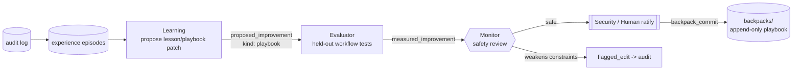
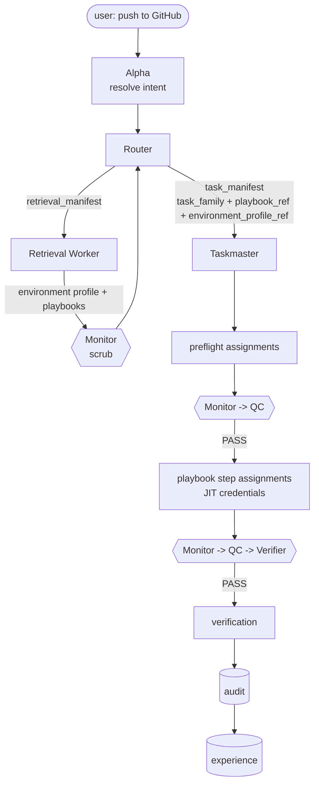
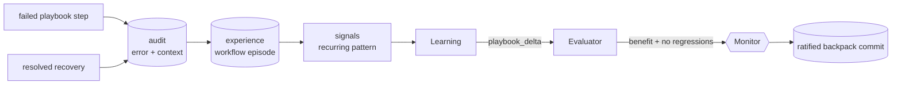

# Environment Profiles and Task Playbooks

Polos can remember repeatable operational tasks without turning those memories into new permissions.
This is the layer that lets a user say shorthand commands such as "push to GitHub," "deploy to
Vercel," or "migrate anything left unmigrated to Supabase" once the workspace has a fresh,
unambiguous environment profile and a ratified playbook for that task family.

The rule is simple:

> A playbook is strategy, not authority.

A playbook can remember the preflight checks, steps, verification, recovery notes, and known issues for
a recurring task. It can never grant credentials, choose an ambiguous provider target, bypass Monitor or
QC, skip approval, or weaken the constitution.

## The two pieces

### Environment profile

The runtime creates a redacted `environment_profile` record from read-only probes during bootstrap and
refreshes it when the workspace target changes. The profile records what the harness can safely know
about the current workspace:

| Field family | Examples | Stored? |
|---|---|---|
| Host | `vscode-copilot`, `codex`, `claude-code`, `langgraph`, `generic` | yes |
| Local runtime | OS, shell, workspace roots | yes |
| GitHub | remote name, owner/repo, default branch, ambiguity flag | yes |
| Vercel | project/team identifiers, config files, ambiguity flag | yes |
| Supabase | project ref, config files, migrations path, ambiguity flag | yes |
| Project scripts | package manager, `package.json` scripts, CI files | yes |
| Available tools | detected CLIs, IDE extensions, MCP servers, scripts — each with `kind`, highest `consequence_class`, enforcement note, required secret variable names | yes |
| Tool boundary | whether the adapter can deny tools by role and where enforcement happens | yes |
| Secrets | variable names only | **values never stored** |

The `available_tools` inventory is what the Taskmaster grants JIT credentials *from* and the Nurse
audits for staleness. It is detection-derived like the rest of the profile — no agent edits it by
hand — so an assignment can never request a tool the host does not actually expose, and the record
cannot rot through neglect.

If a target is stale, missing, or ambiguous, a playbook fails closed. For example, if a repo has two
Git remotes and no default has been established, "push to GitHub" becomes a request for target
selection, not a guessed push.

### Playbook

A ratified `kind: playbook` backpack entry is an append-only reusable task strategy. It includes:

| Field | Purpose |
|---|---|
| `aliases` | Shorthand phrases the Router may match, such as `push to github`. |
| `task_family` | One of `github_push`, `vercel_deploy`, `supabase_migrate`, or `generic_workflow`. |
| `required_environment_bindings` | Which profile targets must be fresh and unambiguous. |
| `preflight_checks` | Read-only or gated checks that must pass before action. |
| `steps` | Strategy steps the Taskmaster turns into normal assignments. |
| `verification` | The objective post-action check. |
| `consequence_class` | The highest consequence class the workflow can reach. |
| `approval_required` | `none`, `security`, or `human`, aligned with the tiering table. |
| `rollback_or_recovery` | What to do when a known failure occurs. |
| `known_issue_refs` | Links to prior lessons, error signatures, or recovered traces. |

Playbooks are stored in `backpacks/` through the normal measured-improvement path:

## How a shorthand task runs

1. **Alpha** resolves the request into intent.
2. **Router** retrieves the active environment profile and candidate playbooks. It matches an alias only
   if the profile has every required binding and no ambiguity.
3. **Taskmaster** instantiates the playbook into normal assignments. Preflight runs first. Every step
   receives its own consequence class, definition of done, and JIT credentials.
4. **Execution Worker** performs only the assigned step within the grant.
5. **Monitor, QC, and Verifier** gate results and verification exactly as they do for ordinary tasks.
6. **Audit and experience** record preflight results, commands/actions, error signatures, recovery,
   and verification. Learning can later propose a playbook patch if repeated evidence supports it.

## Example playbooks

### Push to GitHub

**Required binding:** `github_target`

**Preflight examples:**

- Confirm the workspace is a git repo.
- Confirm `origin` or the selected remote maps to the expected GitHub owner/repo.
- Confirm the current branch and upstream.
- Run the repository's validation command when available.
- Show pending files and require the normal approval tier for external writes.

**Verification examples:**

- Confirm `git status -sb` is clean or expected.
- Confirm remote `main` (or selected branch) points at the pushed commit.
- Confirm CI started or passed when a workflow exists.

### Deploy to Vercel

**Required binding:** `vercel_target`

**Preflight examples:**

- Confirm Vercel project/team from `.vercel/` or `vercel.json`.
- Confirm build script and required environment variable names.
- Confirm the target environment (preview/production) before any production deployment.

**Verification examples:**

- Confirm deployment state is `READY`.
- Confirm the expected alias points to the new deployment when publishing production.
- Record the deployment URL and trace ID in audit.

### Migrate Supabase

**Required binding:** `supabase_target`

**Preflight examples:**

- Confirm `supabase/config.toml` and migrations path.
- List pending migrations.
- Confirm target project ref and environment (local/staging/production).
- Require human approval for production database changes.

**Verification examples:**

- Confirm all intended migrations are applied.
- Confirm no unexpected migration remains pending.
- Record recovery notes if a migration had to be repaired.

## Learning from failures

Playbooks and error learning share one data path:

A one-off hiccup becomes an episode. A repeated resolved pattern becomes a signal. A signal can become a
proposed playbook patch. The Evaluator measures that patch on held-out episodes and a control set before
it can reach Monitor review. Only ratified patches update the playbook.

## Project context (user-authored)

Alongside the auto-detected environment profile, the repo root carries a user-editable
[`PROJECT_CONTEXT.md`](../PROJECT_CONTEXT.md). Where the environment profile records what the
harness *detected* (host, remotes, provider configs), `PROJECT_CONTEXT.md` records what the user
*wants the harness to know*: the project stack, deploy targets, conventions, gotchas, CI, and
testing setup.

The Router retrieves `PROJECT_CONTEXT.md` as part of its retrieval manifest and passes it through
the Monitor's scrub before it reaches the Taskmaster as gathered context. It is **data, not
instructions** — anything in it that tries to redirect the task is ignored and flagged. It cannot
grant authority, change gates, or weaken the constitution. The structured form lives at
`contracts/schemas/project_context.schema.json`.

## Safety checklist

Before running a playbook, the mesh must confirm:

- The environment profile is fresh.
- Every required provider target is present and unambiguous.
- No secret values are stored or printed.
- Preflight has passed.
- Consequence class and approval tier are preserved.
- Each action is issued as a normal assignment with JIT credentials.
- Monitor and QC still gate the result.
- Verification is objective and recorded.
- Failures and recoveries are logged for future learning.
