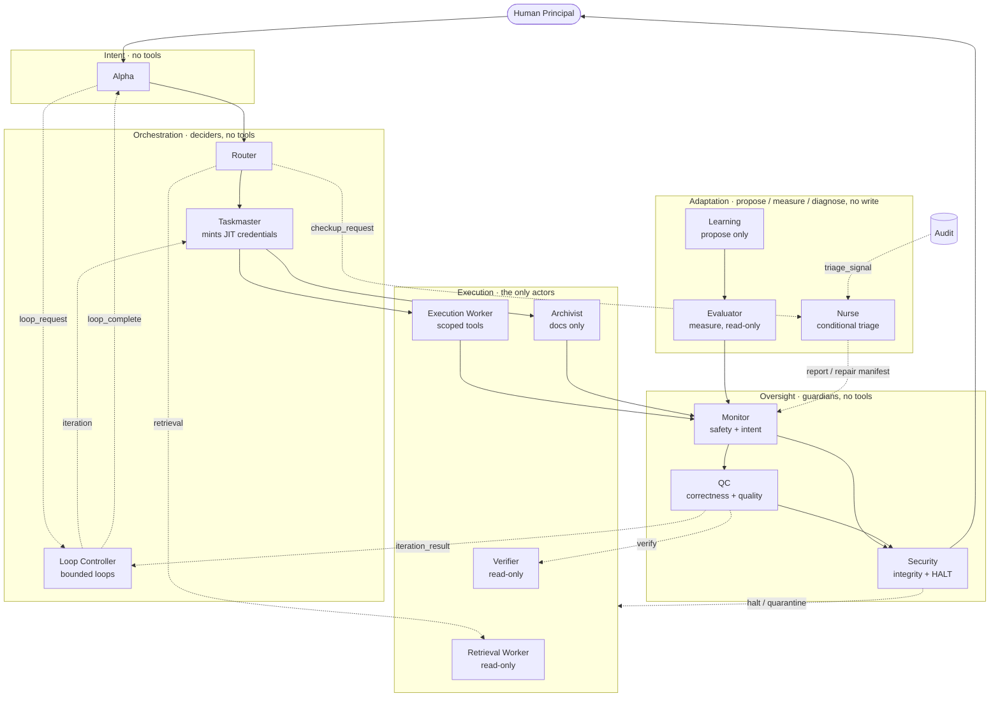
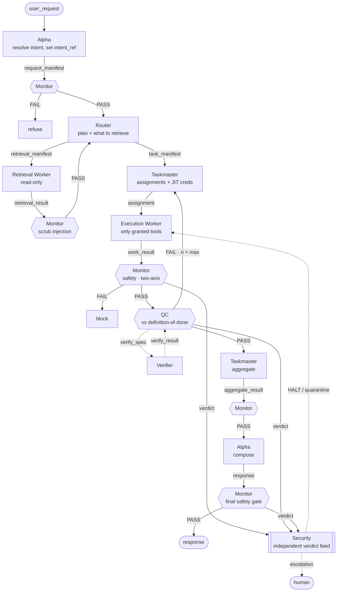
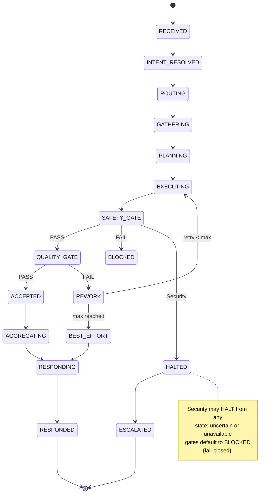
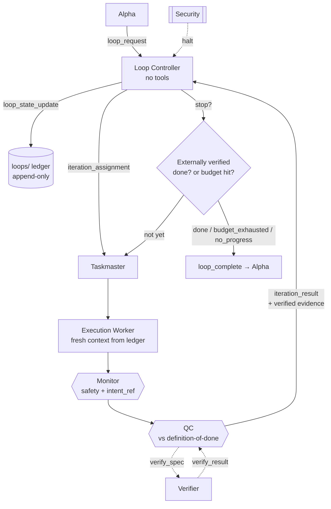
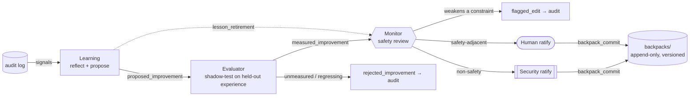
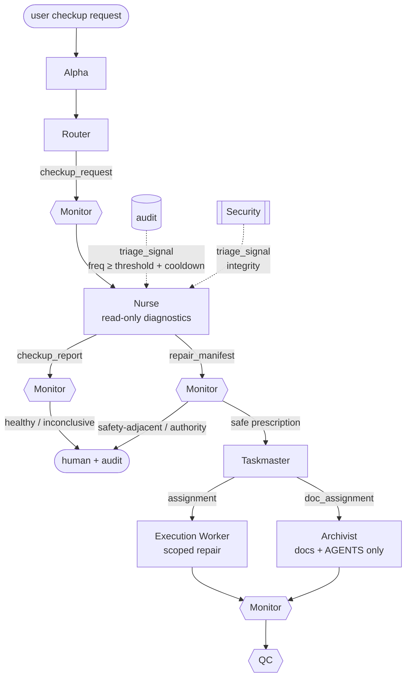

# Polos: Structural Safety, Bounded Autonomy, and Governed Self-Improvement for Agentic AI Systems

**A reference architecture in which safety is a property of topology, not of any single model.**

---

**Authors**

- **Michai M. Morin**, Coeus Institute *(corresponding author)*
- **Dr. Fahim Sufi**, Coeus Institute *(co-author)*

**Affiliation:** Coeus Institute, Research & Development · <https://coeus.institute>

**Published in:** Coeus Institute Open-Source Research · <https://coeus.institute/#/opensource>

**Artifact:** Open specification, AGPL-3.0 · <https://github.com/CoeusInstitute/Polos>

**Document type:** Technical report / architecture paper · **Version 1.1** · 2026-06-17

---

## Abstract

Autonomous language-model agents are increasingly trusted to *act* in the world (writing code, calling
APIs, moving money), yet the dominant safety approach is to make a single model trustworthy and bolt a
content filter onto its output. This conflates the ability to **decide** with the ability to **act**,
and it fails precisely when the model is wrong or adversarially manipulated. We present **Polos**, a
runtime-neutral reference architecture that makes safety a property of system **topology** rather than
of any single model's behavior. Polos decomposes one logical agent into a governed *mesh* of fourteen
specialized roles distributed across five planes (*intent, orchestration, execution, oversight,* and
*adaptation*) under one structural invariant: **anything that can decide cannot act, and anything that
can act cannot act unsupervised.** Deciders hold no effectful tools; a single execution role acts, and
only under just-in-time, least-privilege, time-boxed credentials; tool-less guardians may reject,
rework, quarantine, or halt, but can never act. On this base, Polos adds capabilities that are
normally unsafe to enable without structure: **bounded, externally verified looping** (the
loop-engineering / "Ralph" pattern, constrained by mandatory budgets and a verifier-checked stop
condition), **measured self-improvement** (governed Reflexion, in which one role proposes a lesson, a
*different model lineage* measures it on held-out data, and a human or security role ratifies it before
an append-only commit), **conditional self-healing** (Nurse triage, in which a read-only role
diagnoses harness drift and routes repairs through existing gates), and **repeatable task memory**
(redacted environment profiles, a runtime tool inventory, and ratified playbooks that let shorthand
operational requests expand into safe workflows only when provider targets are known and unambiguous).
Every legal inter-agent message path is enumerated in a single connection graph whose fifteen
completeness invariants are mechanically checked: the current specification passes **423 structural
checks** over **14 role contracts, 65 edges, 39 message types,** and **42 payload schemas**. Polos is
released as an open specification that an agent reads and constructs around an existing codebase, mapped
onto any host stack through adapter notes. We describe the architecture, its formal invariants, its
prompt-injection threat model, its task-memory and self-healing subsystems, and its validation method,
and we are explicit about what the approach does and does not guarantee.

**Keywords:** agentic AI, AI safety, multi-agent systems, prompt injection, separation of privilege,
least privilege, reference monitor, AI control, Reflexion, loop engineering, self-improvement,
capability security, governed autonomy.

---

## Background of the Project

Polos was designed over the course of roughly two years by Coeus Institute, originally as an internal
harness for our own development and operational work. It began as a practical answer to a practical
problem: we wanted to run capable AI agents against real code and real infrastructure without accepting
the risk that a single wrong or manipulated model could take a damaging action. Rather than trusting one
model and bolting on a filter, we built the decide/act separation into the structure of the system and
iterated on it in daily use.

The harness grew with the field. As the research literature and practitioner community produced novel
methods, we studied them, tested what worked against our own workloads, and folded the durable ideas
into the architecture. Capabilities that began as experiments matured into first-class subsystems:
bounded, externally verified looping; measured, authority-preserving self-improvement; repeatable task
memory; and conditional self-healing. Each was adopted only once it could be expressed as part of the
connection graph and checked mechanically, so that a new capability never came at the cost of the core
invariant. The result is a deliberately composed design that draws together some of the strongest
results from the academic papers and open projects it cites, combined under one structural safety model
rather than bolted together as independent features.

Polos is a powerful harness, and it is tailored for organizations that work through AI-leveraged IDEs
and coding agents such as Claude Code, Cursor, VS Code, and GitHub Copilot. It is designed to
**self-assemble**: an agent reads the specification and constructs the mesh around an existing codebase
on whatever stack the organization already uses, then proves the result is complete with the validator
before going live.

Coeus Institute is glad to release Polos under the **AGPL-3.0** license. We do this because we believe
the agentic industry moves forward fastest when the most cutting-edge techniques and methods are openly
available rather than held privately. Sharing the harness that we rely on internally is a direct
expression of that goal: to give the public access to a rigorously safe, continuously improving
foundation for governed autonomy, and to invite the wider community to scrutinize, measure, and build on
it in the open.

---

## 1. Introduction

The unit of useful work in applied AI has moved from the *keystroke* to the *prompt* to the **loop**: a
control process that runs a model repeatedly, lets it call tools, observes the results, and continues
until a goal is met. The same shift that makes agents useful also makes them dangerous. An agent that
can write files, run shell commands, send messages, or spend money is an agent that can cause durable
harm: through its own error, through goal drift over a long run, or because an attacker hid an
instruction in a web page it read.

The prevailing response is to invest in making a *single* model as trustworthy as possible (better
alignment training, a stronger system prompt, a moderation classifier on the output) and then grant
that one model access to tools. We argue this is the wrong shape. It places the power to **decide** what
to do and the power to **act** on that decision inside the same component, so a single failure (a logic
error, a jailbreak, an injected instruction) is sufficient to produce an unsafe action. Defense lives
entirely in one model's behavior, which is exactly the thing under attack.

**Polos** takes a different stance, borrowed from how safety-critical and security-critical systems have
been built for fifty years: *assume no single component is fully trustworthy, and make the system's
safety properties hold structurally*, as a consequence of how components are wired together, not of any
one component behaving. Resisting prompt injection then falls out of the wiring rather than being a
feature that must be maintained. This is separation of privilege, least privilege, and defense in depth
[Saltzer & Schroeder, 1975] applied to cognition, with an always-invoked reference monitor [Anderson,
1972] as the final stop, and with untrusted strong workers supervised by trusted, diverse guardians in
the spirit of recent *AI control* research [Greenblatt et al., 2023].

The single organizing rule, what we call **the invariant**, is:

> **Anything that can decide cannot act. Anything that can act cannot act unsupervised.**

Most of this paper is an account of what it takes to hold that invariant while still doing useful,
autonomous, *improving* work. Four properties must hold at once for autonomy to be safe enough to leave
running unattended:

1. **Structural safety:** the decide/act split above, enforced by topology.
2. **Bounded autonomy (safe looping):** long self-correcting runs that cannot infinite-loop, drift from
   the goal, or explode in cost.
3. **Governed self-improvement:** the system gets better over time by accumulating *measured,
   reversible* lessons, never by expanding its own authority.
4. **Repeatable task memory:** recurring operational requests expand into safe, gated workflows from a
   redacted environment profile, a runtime tool inventory, and ratified playbooks, never from guessed
   targets or self-granted authority.

A fifth, supporting property, **conditional self-healing**, keeps the harness itself faithful to these
contracts over time without granting any role new power (§7.6). Security is the floor of this design, not
its ceiling. The contribution of Polos is not a new prompt-injection filter; it is a topology in which
the *same discipline that contains an untrusted model* is exactly what makes looping, self-improvement,
task memory, and self-healing safe to switch on.

### 1.1 Contributions

- **A topological safety model for agents.** A decomposition of one logical agent into fourteen roles
  across five planes, under a single invariant that separates deciding from acting and forbids
  unsupervised action (§4, §5).
- **A complete, machine-checkable connection contract.** Every legal message path is an edge in one
  graph; fifteen completeness invariants ("no gaps") are enforced by a validator that the specification
  must pass before deployment (§5, §8).
- **Conditional self-healing without self-authorizing.** A read-only Nurse role diagnoses harness drift
  only on user request, Security signal, or thresholded audit evidence, and routes repairs through the
  existing Monitor/Taskmaster/worker paths (§7).
- **Safe looping as a first-class, bounded capability.** A tool-less Loop Controller drives the loop-
  engineering / "Ralph" pattern under mandatory budgets and an *externally verified* stop condition
  (§6).
- **Governed, measured self-improvement.** A separation of *propose / measure / ratify* across distinct
  roles and model lineages, with append-only, reversible commits that can never grant capability or
  weaken a gate (§7).
- **Repeatable task memory that grants no authority.** A redacted environment profile, a runtime
  `available_tools` inventory the Taskmaster grants from and the Nurse audits, and ratified playbooks
  that are *strategy, not permission*: they expand shorthand requests into gated workflows only when
  provider targets are fresh and unambiguous, and fail closed otherwise (§7.5).
- **An open, runtime-neutral artifact.** Polos is published as a specification an agent constructs around
  an existing codebase on any stack, with adapter notes and a validator, under AGPL-3.0 (§9).

### 1.2 Scope and honest framing

Polos is a **specification and reference architecture**, not an empirical benchmark study. Its central
claims are *structural*: that the topology forbids certain failure classes by construction and that the
connection graph is provably complete with respect to the stated invariants. We do not report task-
performance benchmarks or measured attack-success rates against a deployed instance; §10 states this
limitation plainly and §11 outlines the empirical companion work it invites. Where we use the project's
public tagline ("prompt-injection-proof"), we mean *resistance by construction at the architecture
level*; the body of this paper uses the more defensible phrase **prompt-injection resistance by
construction** and is explicit about residual risk.

---

## 2. Background and Related Work

Polos synthesizes five threads of prior work. It does not claim novelty in any single thread; the
contribution is the composition.

**Reasoning-and-acting agents.** The ReAct paradigm [Yao et al., 2023] interleaves chain-of-thought
reasoning with tool use, establishing the perceive, reason, act, observe loop that underlies essentially
all modern tool-using agents. Polos accepts this loop as the unit of work but refuses to let a single
component own all four phases plus the tools.

**Reflective self-improvement.** Reflexion [Shinn et al., 2023] separates an *Actor* that performs a
task, an *Evaluator* that scores the outcome, and a *Self-Reflection* component that converts failures
into verbal lessons stored in memory for the next attempt. Two findings shape our design: a *coarse*
signal (pass/fail, fraction of tests passing) is enough to drive useful reflection, and **"the quality
of your evaluation determines the ceiling of your system's performance."** Reflexion also names the
failure mode we most guard against, **degeneration of thought**, where a model reflecting on its own
reasoning reinforces its own mistakes. Polos adopts the Actor/Evaluator/Reflection split but assigns the
three to *different roles on different model lineages* and inserts a safety gate and human/again-security
ratification before any lesson is adopted (§7).

**Reference monitors and capability security.** The reference-monitor concept [Anderson, 1972] requires
a mediation mechanism that is *always invoked, tamper-proof,* and *small enough to verify*. The
Saltzer–Schroeder principles [1975] (least privilege, separation of privilege, fail-safe defaults,
complete mediation) are the canonical design rules for protection systems. Polos maps the Security role
onto the reference-monitor properties and maps just-in-time, time-boxed, least-privilege credentials onto
capability security (§4.3, §5.4).

**AI control with diverse oversight.** Recent *AI control* work [Greenblatt et al., 2023] studies how a
*trusted but weaker* monitor can safely supervise an *untrusted but stronger* model, including under
intentional subversion. Polos operationalizes this by binding oversight roles (Monitor, QC, Security)
and the Evaluator to a **different model lineage** than the workers, so a jailbreak that fools an actor
does not automatically fool its guardian; *anti-correlated failure* is an explicit design goal (§4.4).

**Loop engineering and the "Ralph" technique.** Through 2025–2026, practitioners reframed agent work as
designing the *loop* rather than writing the *prompt* (Cherny; Steinberger; Osmani). The "Ralph"
technique re-runs a task from a **fresh context plus an updated ledger** until an externally checkable
done-test passes, keeping the intelligence in the spec and the ledger rather than an ever-growing chat
history. The practitioner literature is blunt that naïve loops fail in production via infinite loops,
goal drift, and cost explosion. Polos keeps the technique and adds the guardrails that make it safe to
leave running (§6).

**Indirect prompt injection.** Injecting instructions into content an agent later reads, so-called
"indirect" prompt injection, compromises real-world LLM-integrated applications [Greshake et al., 2023]. Polos's
answer is structural rather than classifier-only: retrieval is delegated to a read-only worker, its
results are *scrubbed* by the Monitor, and retrieved text is treated as **data, never instructions**,
before any decider plans on it (§5.2, §6 of the threat model in §6/Table 6).

The distinguishing move of Polos relative to all of the above is that these mechanisms are not optional
add-ons; they are **edges in a single connection graph whose completeness is mechanically verified**, so
"a guardian was skipped" or "a decider held a tool" is a check failure, not a code review opinion.

---

## 3. Problem Statement and Design Goals

We target the setting of an autonomous agent with access to consequential tools, operating on inputs and
content that may be adversarial, over runs long enough to drift, with a desire to improve over time.

**Threats in scope** (elaborated in §6, Table 6): worker logic error; indirect prompt injection via
retrieved content; a compromised or jailbroken component; goal drift across steps; self-modification
that erodes guardrails; non-terminating loops; loop goal drift; cost/token explosion; degeneration of
thought during self-improvement; and a faked "done" that ends a loop early.

**Design goals.**

| # | Goal | Implication for the design |
|---|---|---|
| G1 | Safety from topology, not from one model | Split *decide* from *act*; no decider holds effectful tools. |
| G2 | Least privilege for every action | Actions run only under JIT, scoped, time-boxed credentials. |
| G3 | Complete mediation | Every result is double-gated (safety then quality); no path bypasses oversight. |
| G4 | Anti-correlated failure | Oversight and the Evaluator run a different model lineage than workers. |
| G5 | Fail-closed | Any uncertain or unavailable gate blocks; ambiguity resolves toward safety. |
| G6 | Corrigibility | The mesh accepts halt and correction without self-preserving. |
| G7 | Bounded autonomy | Loops carry mandatory budgets and an externally verified stop condition. |
| G8 | Authority-preserving improvement | Lessons may tune *how*, never *what the system is allowed to do*. |
| G9 | Auditability | Every message, verdict, and commit is appended to a hash-chained log. |
| G10 | Portability | Runtime-neutral spec; map to any stack via adapters; prove completeness mechanically. |

**Non-goals.** Polos does not attempt to *align* a base model; it *contains* an imperfect one. It does
not eliminate latency or cost overhead; it manages it with a tiering table. It does not prove the
impossibility of same-lineage steganographic collusion; it mitigates it with lineage diversity. These
boundaries are restated as limitations in §10.

---

## 4. System Architecture

Polos organizes fourteen roles into **five planes**. Three planes *do* the work (intent, orchestration,
execution), one *guards* it (oversight), and one *adapts* it by improving, remembering, and self-healing
the harness (adaptation).



**Figure 1.** The five-plane topology. The only column that can affect the world is a single role
(Execution Worker; the Archivist writes documentation only). The only roles that can veto or halt are
tool-less guardians and the human. The Loop Controller (a tool-less decider) drives bounded loops; the
Evaluator (a read-only measurer) gates self-improvement; the Nurse (a read-only diagnostician) runs
conditional harness checkups without repairing directly.

### 4.1 The fourteen roles

| Role | Plane | Holds effectful tools? | Can it act on the world? | Veto / control |
|---|---|:---:|:---:|---|
| **Alpha** | intent | no | no | none |
| **Router** | orchestration | no | no | none |
| **Taskmaster** | orchestration | no (issues credentials) | no | none |
| **Loop Controller** | orchestration | no | no | none |
| **Retrieval Worker** | execution | no (read-only) | reads only | none |
| **Execution Worker** | execution | **yes** (JIT-scoped) | **yes** | none |
| **Archivist** | execution | no (docs write scope) | docs/`AGENTS.md` only | none |
| **Verifier** | execution | no (read-only) | read-only checks | none |
| **Monitor** | oversight | no | no | reject / rework |
| **QC** | oversight | no | no | reject / rework |
| **Security** | oversight | no | no | **HALT / quarantine / escalate** |
| **Learning** | adaptation | no (read-only) | propose only | none |
| **Evaluator** | adaptation | no (sandboxed read-only) | measure only | none |
| **Nurse** | adaptation | no (read-only diagnostics) | diagnose only | none |

**Table 1.** The role catalog. Exactly one role (Execution Worker) holds effectful tools; the Archivist
has a *standing* write scope limited to documentation. Every other role is tool-less or read-only.

### 4.2 Planes, in one sentence each

- **Intent (Alpha).** Resolves the human request into a faithful objective and pins an `intent_ref` that
  rides unchanged through every downstream message; composes the final response.
- **Orchestration (Router, Taskmaster, Loop Controller).** *Deciders.* They plan, decide what to
  retrieve, scope assignments, mint least-privilege credentials, and drive loops, and they hold **no
  effectful tools**.
- **Execution (Retrieval Worker, Execution Worker, Archivist, Verifier).** The only roles that touch
  anything: read-only retrieval, scoped effectful action, documentation writes, and read-only
  verification, respectively.
- **Oversight (Monitor, QC, Security).** *Guardians.* Judgment-only; their only powers are reject,
  rework, quarantine, and HALT. Stopping power may be concentrated; acting power may not.
- **Adaptation (Learning, Evaluator, Nurse).** Learning proposes lessons from logged failures; the
  Evaluator independently measures them; the Nurse conditionally diagnoses harness drift and prescribes
  repairs. None can write to any store.

### 4.3 Least-privilege credentials

No worker holds standing write access. The Taskmaster mints **just-in-time** credentials per assignment:
a specific path, a specific tool set, a short time-to-live (default 300 s), and a consequence class.
Credentials are never standing and never extend to `constitution/**`. This is capability security:
authority is the minimal token required for one task, and it expires.

### 4.4 Diverse oversight (anti-correlated failure)

Models are bound in one file, `models.yaml`, by *class*. Profiles bind four classes mapped to three
model tiers plus diverse-lineage oversight: `decider` (big-thinking), `worker` (cheaper-thinking),
`fast` (fast-process), and `oversight` (a different lineage than decider/worker):

| Profile | Decider | Worker | Fast | Oversight |
|---|---|---|---|---|
| thinking | OpenAI GPT-5.5 | Anthropic Claude Opus 4.8 | xAI Grok 4.3 | Google Gemma 4 |
| balanced | Qwen 3.7 Plus | Z.ai GLM 5.2 | Google Gemma 4 | xAI Grok 4.3 |
| fast | OpenAI GPT-5.4 Mini | Google Gemma 4 | xAI Grok 4.3 | OpenAI GPT-5.4 Mini |

**Table 2.** Example model bindings (operators substitute current model IDs). The Evaluator binds to the
*oversight* class and Learning to the *worker* class, so the agent that *measures* an improvement is a
different lineage than the agent that *proposed* it. The validator refuses a configuration in which
oversight collapses to the decider or worker lineage, or in which the Evaluator and Learning resolve to
the same model. Single-provider hosts default all roles to the available provider and keep oversight on
a different model *family* within it where possible.

---

## 5. The Connection Contract and Formal Properties

Polos's "no gaps" guarantee rests on a single artifact: a connection graph that enumerates **every**
legal inter-agent message path. Senders never choose their own gates; the graph assigns them. A message
on a path not in the graph is, by definition, illegal.

### 5.1 One envelope, total gates

Every message is a `MeshEnvelope` sharing a `trace_id`, the unchanged `intent_ref`, explicit
`gates_required`, a `consequence_class`, and `credentials` (null except on assignments). Each edge
declares its ordered gates and, where gated, an `on_fail` sink. The validator rejects a gated edge
with no failure target.

### 5.2 The path a single request takes



**Figure 2.** Canonical request dataflow. Deciders emit manifests but never touch tools; retrieval is
delegated then **scrubbed** before any decider plans on it (the structural answer to indirect prompt
injection); the Taskmaster mints least-privilege credentials per assignment; every worker result is
**double-gated**, safety (Monitor) first, then quality (QC); even the final response is Monitor-gated
before human delivery. Security observes every verdict on a side channel and can HALT independently.

### 5.3 The request lifecycle as a state machine



**Figure 3.** Request lifecycle. Every state defines PASS, FAIL, and UNCERTAIN transitions; there is no
undefined state. Safety always precedes quality. Rework is bounded by `rework_max`, after which a best-
effort response carries an explicit caveat. Security may HALT from any state.

### 5.4 Formal invariants

Let $\mathcal{R}$ be the set of roles. Let $\mathrm{decide}(r)$, $\mathrm{act}(r)$, and
$\mathrm{tools}(r)$ denote, respectively, that role $r$ is a decider, can affect external state, and
holds effectful tools. The **core invariant** is

$$
\forall r \in \mathcal{R}:\quad \mathrm{decide}(r) \Rightarrow \neg\,\mathrm{tools}(r)
\qquad\wedge\qquad
\mathrm{act}(r) \Rightarrow \mathrm{supervised}(r),
$$

with $\mathrm{tools}(r) \Rightarrow r = \texttt{execution-worker}$ as a capability ceiling. **Complete
mediation** of a worker result $w$ requires safety *before* quality:

$$
\mathrm{accept}(w) \;\Rightarrow\; \big(\mathrm{Monitor}(w)=\textsf{PASS}\big)\,\prec\,\big(\mathrm{QC}(w)=\textsf{PASS}\big),
$$

where $\prec$ denotes temporal precedence. **Fail-closed** sets the default transition
$\delta(\textsf{UNCERTAIN}) = \textsf{BLOCKED}$. These are not prose aspirations: each maps to a
mechanically checked completeness invariant.

| ID | Invariant (informal) | Enforces |
|---|---|---|
| **I1** | Every declared output has an outbound edge of that type | graph/role consistency |
| **I2** | Every declared input has an inbound edge of that type | graph/role consistency |
| **I3** | Every worker result / doc change is gated Monitor **then** QC | complete mediation (G3) |
| **I4** | Every gated edge defines an `on_fail` target | no silent failure |
| **I5** | Every request path ends at exactly one terminal | no dangling flow |
| **I6** | No non-execution role carries tools or credentials | decide ≠ act (G1) |
| **I7** | No edge writes to `constitution/**` | immutability of rules |
| **I8** | Security reaches every other role via halt/quarantine and sees verdicts independently | reference monitor (G6) |
| **I9** | Backpack commits originate only from Security or Human; Learning may only propose | authority preservation (G8) |
| **I10** | Every gate emits an audit entry per decision | auditability (G9) |
| **I11** | Control edges (halt/quarantine) act uniformly from any state | corrigibility (G6) |
| **I12** | A loop declares budgets + an externally verifiable stop condition; Loop Controller holds no tools | bounded autonomy (G7) |
| **I13** | A proposed improvement must pass the Evaluator before reaching the Monitor | measured improvement (G8) |
| **I14** | Improvement commits are append-only, versioned, and add only lessons/playbooks | no authority creep (G8) |
| **I15** | Nurse triage is conditional, read-only, thresholded, and repair-routed through normal gates | harness integrity without authority creep |

**Table 3.** The fifteen completeness invariants. The Security role intentionally has *no* self-halt
edge in I8: it is corrigible and subordinate to an external human kill switch, not to itself.

### 5.5 Tiering: not over-gating cheap work

Mediation is total but proportionate. A consequence class determines the gates and the required
approver, enforced as a *precondition on credential activation* at the tool boundary rather than as an
extra message:

| Consequence class | Reversible | Gates | Approval |
|---|---|---|---|
| read | yes | monitor | none |
| docs | partial | monitor, qc | none |
| write-internal | partial | monitor, qc | none |
| comms | no | monitor, qc | Security |
| external-write | no | monitor, qc | Security |
| code-exec | no | monitor, qc | **Human** |
| financial | no | monitor, qc | **Human** |

**Table 4.** The tiering table (consequence × reversibility). Low-consequence, reversible work passes a
single gate; irreversible or high-consequence work requires Security or human approval before the tool
runs.

---

## 6. Bounded Autonomy: Safe Looping

A task may run as a self-correcting **loop** rather than a single pass. Looping is driven by the tool-
less **Loop Controller**, a decider that chooses the next iteration, decides when to stop, and decides
when to give up, and, like every decider, never touches the world. Invariant **I12** and the
constitution bind it.

The practitioner literature identifies four ways loops fail; each has a structural answer in Polos.

| Failure mode | Polos's structural answer |
|---|---|
| **Infinite loop** | Mandatory budgets (`max_iterations`, `max_wall_clock_seconds`, `max_cost_usd`, `no_progress_patience`). A budget hit **stops and reports**; budgets are never extended to "just finish." |
| **Faked "done"** | The stop condition is verified by the **Verifier through QC**, never self-reported. A loop with no externally checkable done-test is rejected outright. |
| **Goal drift** | `intent_ref` is carried unchanged through every iteration, so the Monitor checks faithfulness on each pass and Security correlates drift across iterations. |
| **Cost explosion** | The cost budget is a hard ceiling; `no_progress_patience` stops a loop spinning without measurable, verified progress. |
| **Repeating dead ends** | Each iteration runs from a **fresh context rebuilt from the external ledger**, including the append-only log of what prior iterations tried and why they failed (the Ralph pattern). |
| **Runaway** | Security can **HALT** a loop from any state; the system is fail-closed. |

**Table 5.** Loop failure modes and their answers.



**Figure 4.** The loop lifecycle. Each iteration is a *full pass through the normal safety mesh*
(Monitor, then QC, then Verifier), so looping repeats the gated cycle rather than bypassing it. The key
design move is that the intelligence lives in **the spec, the externally verifiable stop condition, and
the ledger**, not in an ever-growing chat history; this is what lets each iteration start clean without
losing the thread. `loop_complete.status` is never `done` unless the Verifier confirmed it; on
`budget_exhausted` or `no_progress`, the controller returns the best *verified* state with an explicit
caveat.

Mesh-wide ceilings live in `mesh.config.yaml` (`max_iterations: 25`, `max_wall_clock_seconds: 3600`,
`max_cost_usd: 25.0`, `no_progress_patience: 3`, `require_external_stop_condition: true`); a per-request
budget may be stricter but never looser.

---

## 7. Governed Self-Improvement: Measured Reflexion

The mesh gets better the way a careful engineering organization does: it accumulates **evidence-tested,
reversible lessons**, not new permissions. The design is Reflexion [Shinn et al., 2023] with the
proposer and the evaluator kept deliberately separate, governed by invariants **I9, I13, I14**.

The mapping from Reflexion to Polos roles is the crux:

| Reflexion role | Polos role | Why separated |
|---|---|---|
| Actor | the **workers** | They generate the episodes that get reflected on. |
| Self-Reflection | **Learning** (adaptation) | Distills logged failures into *proposed* lessons; can only propose. |
| Evaluator | **Evaluator** (adaptation) | Independently measures each proposal on held-out history; *different lineage*. |



**Figure 5.** The governed self-improvement lifecycle. Splitting *propose* (Learning) from *measure*
(Evaluator) from *approve on safety* (Monitor) is the direct mitigation for **degeneration of thought**:
no role can both invent a lesson and bless it. A proposal that weakens any constraint is flagged and
logged; measured benefit does not buy a safety exception.

The lifecycle in steps:

1. **Reflect.** Learning reads failure `signals`, performs root-cause analysis on completed episodes,
   and frames a *falsifiable* hypothesis: "applying X should reduce failure Y without regressions."
2. **Propose, only.** Learning emits a `proposed_improvement`. It has no write path to any store and
   must route to the Evaluator first (I13).
3. **Measure.** The Evaluator assembles a **held-out** evaluation set from the `experience/` store
   (episodes that showed the target failure, plus a control set that did not), shadow-applies the change
   in a read-only sandbox, and measures **both** benefit and regressions. It forwards a
   `measured_improvement` only if the benefit clears `min_measured_benefit` (default 0.05) with **zero**
   regressions on a sample of at least `eval_min_sample` (default 20) episodes; otherwise it emits
   `rejected_improvement` with the numbers. Measuring on held-out data prevents overfitting to the
   traces that generated the proposal.
4. **Review for safety.** The Monitor checks the now-evidence-backed proposal against the constitution.
5. **Ratify.** Non-safety changes are ratified by Security; safety-adjacent ones by a human.
6. **Commit.** Lessons and playbooks are versioned and **append-only**; retiring a lesson writes a
   tombstone (`lesson_retirement`), never a deletion, so every change is reversible and auditable.

**The boundary that matters (I14):** lessons and playbooks may change the *how*: heuristics,
strategies, playbooks. They may **never** change the *what the system is allowed to do*: capabilities,
the constitution, or the strength of any gate. *A mesh that improves can get better at its job; it can
never expand its own authority.* That asymmetry is the entire point.

### 7.5 Repeatable Task Memory: Environment Profiles, Tool Inventory, and Playbooks

A practical autonomous agent is asked to repeat operational tasks such as "push to GitHub," "deploy to
Vercel," or "migrate Supabase." The naïve way to support shorthand is to let the agent infer the target
and reach for a tool; that is exactly the decide-and-act collapse Polos forbids. Polos instead gives the
mesh a **memory of repeatable tasks that grants no authority**, resting on three artifacts that are all
*data, never instructions or permissions*.

**The environment profile.** At bootstrap and whenever the workspace target changes, the runtime writes
a redacted `environment_profile` (schema-checked) from read-only probes: host kind, OS/shell, workspace
roots, git remotes, detected GitHub/Vercel/Supabase targets, package scripts, CI files, the approval
policy, and the tool-boundary facts the adapter can enforce. Crucially it stores **secret variable
*names* only, never values** (`secret_names_only` is a schema constant of `true`). If a provider target
is missing, stale, or ambiguous (e.g. two git remotes with no chosen default), the profile marks it
ambiguous and any shorthand task **fails closed** until a human chooses; the architecture never guesses
a destination for an irreversible action.

**The tool inventory.** The profile carries an `available_tools` array, the runtime-detected set of
CLIs, IDE extensions, MCP servers, and scripts the host actually exposes, each tagged with its `kind`,
its highest reachable `consequence_class` (aligned to the tiering table of §5.5), the enforcement point,
and any required secret *names*. This inventory is the concrete grounding for least privilege (G2): the
**Taskmaster grants just-in-time credentials only from `available_tools`, never above a tool's recorded
consequence class**, and an assignment that requests a tool absent from the inventory is refused rather
than improvised. Because the inventory is detection-derived like the rest of the profile, no agent
hand-maintains it and it cannot silently rot; the Nurse audits its freshness during a checkup (§7.6).

**Ratified playbooks.** A playbook is a reusable task strategy stored append-only in `backpacks/`
through the same measured-improvement path as any lesson (§7): aliases the Router may match, the
`task_family`, the required environment bindings, preflight checks, strategy steps, an objective
verification, the highest consequence class, and recovery/known-issue notes. The governing rule is:

> **A playbook is strategy, not authority.**

It can remember *how* a recurring task is done well; it can never grant credentials, choose an ambiguous
target, skip a gate, or weaken the constitution. When the Router matches a shorthand alias, it does so
only if the environment profile supplies exactly one fresh, unambiguous target; the **Taskmaster then
instantiates each playbook step as a normal assignment** with its own consequence class, JIT
credentials, Monitor/QC gates, and verification. Preflight runs first and a failed preflight blocks the
workflow rather than being skipped.

**User-authored project context.** Alongside the auto-detected profile, the repo root carries a
hand-edited `PROJECT_CONTEXT.md` capturing the project stack, deploy targets, conventions, and gotchas
the user wants the harness to know. The Router retrieves it as a retrieval target, the Monitor scrubs
it, and it reaches the Taskmaster as **gathered context: data, not instructions**. Like retrieved web
content, anything in it that tries to redirect the task is ignored and flagged; it can grant no
authority, change no gate, and weaken no rule.

The payoff is that a one-line operational request expands into the *same* gated workflow a fully
specified request would receive (preflight, scoped action, double-gated result, objective verification,
and an audit trail) with the convenience of shorthand and none of the decide-and-act collapse it
normally invites.

### 7.6 Conditional Self-Healing: Nurse Triage

The harness itself can drift: a broken graph edge, a stale derived count, a missing schema, a mismatched
model binding, or a pattern of runtime failures that points back to the wiring rather than the user's
task. Polos answers this with a **read-only Nurse** role and invariant **I15**, designed so that
self-healing never becomes self-authorizing.



**Figure 6.** Conditional Nurse triage. The Nurse may run **only** on an explicit human checkup request,
a Security integrity signal, or an audit-derived failure pattern that has crossed a configured frequency
threshold *and* cooldown; a single ordinary task failure never wakes it. It holds read-only diagnostic
tools (it may inspect role cards, `models.yaml`, the flow graph, schemas, the state machine, the
`available_tools` inventory, derived docs and counts, and run the validator as a diagnostic) but it
**never edits a file, mints a credential, commits a backpack, or repairs directly**. Its output is a
prescription: a `repair_manifest` that must pass the Monitor and is then instantiated by the Taskmaster
as ordinary scoped work (Execution Worker for canonical/tooling repairs, Archivist for derived docs)
under the normal Monitor/QC gates. Repairs that would touch `constitution/**`, weaken a gate, or broaden
capability are marked `requires_human` and never run automatically. Nurse triage is *maintenance, not
improvement*: it restores broken wiring to the canonical contracts, and it cannot create authority or
bypass the Learning → Evaluator path for lessons and playbooks.

---

## 8. Implementation and Validation

Polos is specified as a set of canonical, machine-readable contracts and a validator that proves their
mutual consistency before any deployment.

**Canonical layers (authoritative).** `constitution/core.md` (immutable rules), `roles/*.agent.md`
(fourteen role contracts as YAML front-matter + a system-prompt body), `contracts/` (the envelope
schema, the flow graph, the state machine, and one payload schema per message type), and `models.yaml`
(model binding). `AGENTS.md` files and everything under `docs/`, including this paper, are *derived*
views; on any contradiction the canonical source wins.

**The validator.** `tools/validate_mesh.py` mechanically checks the completeness invariants of §5.4: it
verifies JSON/YAML well-formedness; exact two-way consistency between each role card's declared
handoffs/inputs/outputs and the edges in the flow graph; that a payload schema exists for every message
type and that no orphan schema exists; capability ceilings (only the Execution Worker holds effectful
tools; only the Archivist has a standing write scope; only the Taskmaster issues credentials; veto only
for oversight); model-registry sanity including diverse decider/worker/oversight lineage and a distinct
Evaluator/Learning binding (I13); loop-budget and external-stop fields (I12); the append-only,
lesson/playbook-only shape of improvement commits (I14); Nurse trigger/cooldown and repair-routing
constraints (I15); the environment-profile hardening including the `available_tools` inventory shape; and
DOX index reachability.

**Validator robustness.** The validator is itself engineered to fail safely and portably. Its
well-formedness sweep is scoped to canonical spec files only, ignoring dependency and runtime trees
(`.venv`, `.git`, and the runtime stores) so spec validity never couples to runtime data; role-card
front-matter parsing tolerates CRLF and a missing trailing newline so a Windows checkout does not
produce a false failure; and a missing or malformed canonical file is reported as a clean `FAIL` rather
than a Python traceback. These properties mean the single `PASS` line is a trustworthy gate across hosts.

| Quantity | Count |
|---|---:|
| Role contracts (agent cards) | 14 |
| Legal edges in the connection graph | 65 |
| Distinct inter-agent message types | 39 |
| Payload + runtime schemas | 42 |
| Structural checks performed | **423** |

**Table 6.** Specification scale and validation coverage at v1.1. The validator's success criterion is a
single line, *"PASS, every enforced completeness invariant holds,"* and it runs in continuous
integration on every change, so a specification that has drifted out of consistency cannot be merged.

We emphasize the *type* of guarantee this provides. The 423 checks prove **structural completeness**:
that the wiring matches the contracts, that no path bypasses a required gate, that no decider holds a
tool, and that the safety-relevant invariants hold over the specification. They do **not** measure how
often a given base model resists a given attack at runtime; that is empirical and out of scope here
(§10).

---

## 9. Reproducibility and Use

Polos is an **open specification that an agent reads and builds around an existing codebase**, not a
server to install. There are two on-ramps.

**Build it yourself.**

```bash
git clone https://github.com/CoeusInstitute/Polos.git
cd Polos
pip install -r tools/requirements.txt
python tools/validate_mesh.py        # expect: PASS - every enforced completeness invariant holds.
```

Then bind models in `models.yaml` (keep oversight and the Evaluator on a different lineage than the
workers), choose the note in `adapters/` matching your stack (VS Code / GitHub Copilot, LangGraph, or
the generic function-calling loop), and follow `BUILD.md`, which wires the roles, the flow graph, and the
gates in order. Re-run the validator and confirm it still prints `PASS`.

**Point your agent at it.** Open any project in an AI coding tool and instruct the agent to fetch the
repository, read `AGENTS.md` (the entry point) and then `BUILD.md`, construct the mesh adapted to your
stack via the matching adapter note, bind models, and run `python tools/validate_mesh.py` until it prints
`PASS`. The bootstrap protocol is written to be followed literally and in order, so smaller models can
build it reliably; the validator mechanically proves the result is complete.

**The one rule a host must enforce.** Some roles have tools and some must not. If the host cannot *deny*
tools to deciders and oversight, the core invariant fails and the system must not be deployed. The
prompt layer is softer than a hardware boundary; the **tool layer**, not the prompts, must enforce the
decide/act split.

---

## 10. Limitations

We are deliberately explicit about what Polos does *not* claim.

- **It contains, it does not align.** Polos does not make a base model safe; it bounds an imperfect one.
  A sufficiently capable, sufficiently motivated worker model is still untrusted by design; the topology
  is what keeps that from mattering.
- **No empirical attack-success numbers.** This paper reports structural guarantees and validator
  coverage, not measured prompt-injection or jailbreak resistance against a running instance. "Prompt-
  injection resistance by construction" is an architectural property, not a measured rate.
- **Same-lineage collusion is mitigated, not proven impossible.** Diverse model lineage reduces
  correlated failure and steganographic collusion between a worker and its guardian, but does not prove
  it cannot occur.
- **Overhead is real.** Multiple gated roles add latency and cost relative to a single agent; the tiering
  table (§5.5) exists precisely so low-consequence work is not over-gated, but the overhead is not zero.
- **The prompt layer is soft.** Invariants I6/I7 are only as strong as the host's enforcement of the
  tool/no-tool split at the tool boundary; a host that grants a decider a tool violates the model
  regardless of what the prompts say.
- **Structural completeness ≠ behavioral correctness.** The validator proves the wiring matches the
  contracts; it cannot prove a Monitor will *judge* correctly on a novel input. The architecture reduces
  the blast radius of a wrong judgment; it does not eliminate wrong judgments.

---

## 11. Future Work

- **Empirical companion study.** Benchmark Polos-hosted loops against single-agent baselines on coding,
  retrieval, and self-improvement tasks, including red-team measurement of indirect-prompt-injection
  success rates with and without the retrieval-scrub gate.
- **Path-traversal proofs for terminals.** Extend the validator from edge-level checks to full request-
  path traversal, mechanically proving I5 terminal uniqueness for every reachable flow.
- **Semantic lesson analysis.** Add automated analysis that a free-text lesson delta cannot encode a
  capability or constraint change, hardening I14 beyond the Monitor's judgment.
- **Approval messages as first-class edges.** Optionally promote tiered Security/Human approvals from a
  credential-activation precondition into explicit graph edges for hosts that want every approval in the
  audit graph itself.
- **Formal model checking.** Encode the state machine and invariants in a model checker to obtain machine-
  proved safety properties over the abstract design.

---

## 12. Conclusion

Most agent frameworks try to make one model trustworthy enough to hand it power. Polos assumes no single
component is fully trustworthy and makes safety a property of how the components are wired: **anything
that can decide cannot act, and anything that can act cannot act unsupervised.** From that single
invariant follow least-privilege credentials, complete double-gated mediation, diverse anti-correlated
oversight, fail-closed defaults, and corrigibility; and, crucially, the *same* discipline makes four
normally-dangerous capabilities safe to enable: bounded, externally verified looping; measured,
authority-preserving self-improvement; repeatable task memory that grants no authority; and conditional
self-healing. Because every legal message path is an edge in one graph whose fifteen completeness
invariants are mechanically checked, "no gaps" is a property the specification must *pass*, not a claim a
reviewer must take on faith. Polos is offered as an open, runtime-neutral artifact so that practitioners
can build governed autonomy onto whatever stack they already use, and so the research community can
scrutinize, measure, and improve the design in the open.

---

## Acknowledgments

This work was developed through the research and development efforts of **Coeus Institute**. The authors
thank the broader practitioner and research communities whose work on reasoning-and-acting agents,
reflective self-improvement, reference monitors, capability security, AI control, and loop engineering
forms the foundation this architecture composes.

---

## References

1. J. P. Anderson. *Computer Security Technology Planning Study.* ESD-TR-73-51, USAF Electronic Systems
   Division, 1972. (Origin of the *reference monitor* concept: always-invoked, tamper-proof,
   verifiable.)
2. J. H. Saltzer and M. D. Schroeder. "The Protection of Information in Computer Systems."
   *Proceedings of the IEEE*, 63(9):1278–1308, 1975. (Least privilege, separation of privilege, fail-
   safe defaults, complete mediation.)
3. S. Yao, J. Zhao, D. Yu, N. Du, I. Shafran, K. Narasimhan, and Y. Cao. "ReAct: Synergizing Reasoning
   and Acting in Language Models." *ICLR*, 2023. arXiv:2210.03629.
4. N. Shinn, F. Cassano, E. Berman, A. Gopinath, K. Narasimhan, and S. Yao. "Reflexion: Language Agents
   with Verbal Reinforcement Learning." *NeurIPS*, 2023. arXiv:2303.11366.
5. K. Greshake, S. Abdelnabi, S. Mishra, C. Endres, T. Holz, and M. Fritz. "Not What You've Signed Up
   For: Compromising Real-World LLM-Integrated Applications with Indirect Prompt Injection." *AISec
   Workshop*, 2023. arXiv:2302.12173.
6. R. Greenblatt, B. Shlegeris, K. Sachan, and F. Roger. "AI Control: Improving Safety Despite
   Intentional Subversion." 2023. arXiv:2312.06942.
7. B. Cherny. "Write loops, not prompts," on agentic loop engineering (Claude Code). Practitioner
   talk/writing, 2025. *(Industry source.)*
8. P. Steinberger and A. Osmani. Writings naming and developing the practice of *loop engineering* and
   the "Ralph" technique (re-run from a fresh context + ledger until an external done-test passes).
   Practitioner sources, 2025–2026. *(Industry sources.)*

> **Citation note.** References 1–6 are the academic lineage this architecture composes; arXiv
> identifiers are provided for convenience and should be confirmed against the canonical record before
> formal republication. References 7–8 are practitioner/industry sources for the loop-engineering
> practice and are cited as such.

---

## Appendix A: Canonical Artifact Map

| Path | Role in the specification | Authority |
|---|---|---|
| `constitution/core.md` | The immutable invariant, ceilings, gates, tiering, defaults | Authoritative |
| `roles/*.agent.md` | Fourteen role contracts (front-matter) + system prompts | Authoritative |
| `contracts/envelope.schema.json` | The single `MeshEnvelope` shape | Authoritative |
| `contracts/flow.graph.yaml` | Every legal edge, its gates, and invariants I1–I15 | Authoritative |
| `contracts/state-machine.md` | Request lifecycle, PASS/FAIL/UNCERTAIN transitions | Authoritative |
| `contracts/schemas/*.schema.json` | One payload schema per message type, plus the off-graph `episode`, `environment_profile`, and `project_context` records | Authoritative |
| `models.yaml` | Model binding by class; diverse lineage | Authoritative |
| `mesh.config.yaml` | On/off switches and numeric ceilings | Authoritative |
| `environment/AGENTS.md` | Redacted host/provider profile + `available_tools` inventory (runtime store) | Runtime contract |
| `PROJECT_CONTEXT.md` | User-authored project stack/targets/conventions; retrieved as scrubbed data | Runtime data |
| `tools/validate_mesh.py` | Mechanical completeness checker (423 checks) | Tooling |
| `BUILD.md` | The agent bootstrap protocol | Procedure |
| `adapters/*.md` | Stack-specific build notes (additive) | Derived |
| `AGENTS.md`, `docs/**` | Human-facing derived documentation (incl. this paper) | Derived |

## Appendix B: Worked Trace (condensed)

**User asks:** *"Add a `/health` endpoint to our API service and update the docs."*

1. **Human → Alpha** (`user_request`): `intent_ref` is pinned to the request text.
2. **Alpha → Monitor → Router** (`request_manifest`): objective + success criteria + constraints ("no
   change to auth"). Monitor, Axis A (faithful to intent): PASS; Axis B (harmful?): PASS.
3. **Router → Retrieval Worker** (`retrieval_manifest`): read-only retrieval scoped to `repo:src/api`;
   the `retrieval_result` is **scrubbed** by the Monitor for injected instructions before the Router
   plans on it.
4. **Router → Taskmaster** (`task_manifest`): sub-goals "implement endpoint" and "update docs".
5. **Taskmaster → Execution Worker** (`assignment` + JIT credentials): scope
   `write:src/api/health.*`, tools `{fs.write, run.tests}`, a ten-minute TTL, `consequence_class:
   code-exec`, which the tiering table requires a **human** to approve before the tool runs.
6. **Execution Worker → Monitor → QC** (`work_result`, double-gated): Monitor confirms the action stayed
   inside the grant (no auth change) → PASS; QC checks against the definition of done and dispatches a
   `verify_spec` to the **Verifier**, which runs the suite in a sandbox and returns
   `verify_result{passed:true}` → `accepted_result`.
7. **Taskmaster → Archivist** (`doc_assignment`): the Archivist updates the docs to mention `/health`,
   derived from the actual change; its `doc_change` passes Monitor then QC → `doc_committed`.
8. **Taskmaster → Monitor → Alpha → Monitor → Human** (`response`): a final safety/intent gate before
   delivery. Every hop is appended to the hash-chained audit log under one `trace_id`.

*If something had gone wrong:* a QC FAIL produces a bounded `rework_request`; a Monitor FAIL blocks
before QC and emits a verdict to Security; a pattern of scope-creep across messages lets Security
`quarantine` the worker, `halt` the deciders, and `escalation` to the human with correlated evidence.

## Appendix C: Threat Model Coverage

| ID | Threat | Structural answer |
|---|---|---|
| T1 | Worker logic error | QC gate vs definition-of-done; bounded rework. |
| T2 | Indirect prompt injection via retrieved content | Delegated retrieval; Monitor scrub; retrieved text is data, never instructions. |
| T3 | Compromised / jailbroken component | Diverse-lineage oversight (anti-correlated failure); a fooled decider holds no tools. |
| T4 | Goal drift across steps | `intent_ref` carried unchanged; Monitor Axis A each hop; Security correlates drift. |
| T5 | Self-modification erodes guardrails | Immutable constitution; propose-only Learning; measured then ratified; I14. |
| T6 | Loop never terminates | Mandatory budgets with hard ceilings; a hit stops and reports (I12). |
| T7 | Loop drifts from the goal | `intent_ref` unchanged each iteration; Monitor checks faithfulness; Security correlates. |
| T8 | Cost / token explosion | Hard cost ceiling; `no_progress_patience` stops a spinning loop. |
| T9 | Degeneration of thought | Evaluator is a different lineage than Learning; propose/measure/approve are three roles (I13). |
| T10 | Faked "done" ends a loop early | Stop conditions verified by the Verifier through QC, never self-reported. |

---

*© 2026 Coeus Institute. Polos is released as open source under AGPL-3.0. This paper is a derived
documentation artifact; on any conflict, the canonical specifications in the Polos repository govern.*
