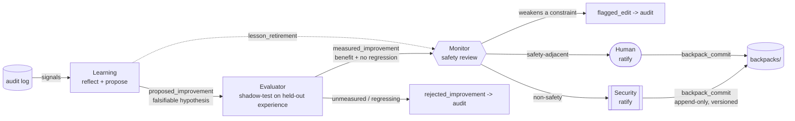

# Self-Improvement — Governed, Measured Reflexion

One of the capabilities that makes this mesh more than a security wrapper. The mesh gets better over
time the way a careful engineering org does: it accumulates **evidence-tested lessons and playbooks**,
not new permissions. Improvement here is *measured before adoption, append-only, reversible, and
bounded* — and crucially, **evaluated by a different mind than the one being improved.**

## The method it builds on
The reference point is **Reflexion** (Shinn et al., 2023). Reflexion separates self-improvement into
three distinct models: an **Actor** that does the work, an **Evaluator** that scores the result, and a
**Self-Reflection** component that turns failures into verbal lessons stored in memory and fed into the
next attempt. The empirical findings that shape this mesh's design are:

- A **coarse signal** (success/fail, fraction of tests passing) is enough to drive useful reflection.
- **Execution-based signals plus verbal reflection** outperform either alone; blind trial-and-error
  with no reflection step barely improves at all.
- **"The quality of your evaluation determines the ceiling of your system's performance."** The
  Evaluator is not a formality — it is the cap on how good the whole loop can get.

## The failure mode this is built to avoid
The most documented failure of reflective agents is **degeneration of thought**: when a model reflects
on *its own* reasoning, it tends to reinforce the same flawed assumptions rather than escape them —
confirmation bias in a loop. The literature's fix is to **separate the generator from the critic** and,
better still, use **different model lineages / personas** so the critique is genuinely independent.

This mesh takes that seriously by splitting the work across three roles in three planes, with the
Evaluator on a **different model lineage** than the proposer:

| Reflexion role | Mesh role | Why it's separated |
|---|---|---|
| Actor | the **workers** (Execution / Retrieval) | They produce the episodes that get reflected on. |
| Self-Reflection | **Learning** (adaptation) | Distills logged failures into *proposed* lessons/playbooks — but **can only propose.** |
| Evaluator | **Evaluator** (adaptation) | **Independently measures** each proposal against held-out history; different lineage, so it doesn't share the proposer's blind spots. |

Separating "propose" (Learning) from "measure" (Evaluator) from "approve on safety" (Monitor) is what
makes the improvement **robust instead of superstitious.** No single role can both invent a lesson and
bless it.

## The lifecycle
Governed by the [constitution](../constitution/core.md) (§Self-Improvement) and enforced by invariants
**I9, I13, I14**.

Step by step:

1. **Reflect.** Learning reads failure `signals` from the audit log, performs Reflexion-style
   root-cause analysis on completed episodes, and frames a **falsifiable hypothesis**: *"applying X
   should reduce failure Y without regressions."*
2. **Propose — only.** Learning emits a `proposed_improvement`. It has **no write path to any store**;
   it can never grant capability, relax a gate, or touch the constitution. Every proposal must go to
   the Evaluator **first** (I13).
3. **Measure (the robustness step).** The **Evaluator** assembles a held-out evaluation set from the
   [`experience/`](../experience) store — episodes that exhibited the target failure, plus a control
   set that did not. For playbooks, the set is filtered by task family, playbook id, and compatible
   environment profile. The Evaluator shadow-applies the proposed change in a read-only sandbox and
   measures **both** the benefit (reduction in the target failure) and **regressions** (new failures on the control set).
   It forwards a `measured_improvement` to the Monitor **only** if the benefit clears
   `min_measured_benefit` with **zero** regressions; otherwise it emits `rejected_improvement` with
   the numbers. Measuring on *held-out*
   data (not the traces that generated the proposal) is what prevents overfitting.
4. **Review for safety.** The **Monitor** checks the (now evidence-backed) proposal against the
   constitution. Anything that would weaken a constraint is flagged and logged — measured benefit does
   not buy a safety exception.
5. **Ratify.** Non-safety changes are ratified by **Security**; safety-adjacent ones by a **human**.
   Only then does a `backpack_commit` land.
6. **Commit — append-only and reversible.** Lessons and playbooks are **versioned, never overwritten**.
   Retiring a lesson writes a tombstone (`lesson_retirement`), it does not delete history, so any change
   can be rolled back and audited.

## What may and may not change
This is the boundary that keeps "self-improvement" from becoming "self-modification" (invariant I14):

- **May change:** heuristics, strategies, playbooks, and lessons — the *how* of doing work well.
- **May never change:** capabilities/permissions, the constitution, or the strength of any gate — the
  *what the system is allowed to do.*

Playbooks are structured, repeatable task strategies (for example `github_push`, `vercel_deploy`, or
`supabase_migrate`) with aliases, required environment bindings, preflight checks, steps, verification,
recovery notes, and known issue refs. They still run through environment-profile target resolution,
consequence tiers, JIT credentials, Monitor/QC gates, and verification. See [PLAYBOOKS.md](PLAYBOOKS.md).

A mesh that improves can get **better at its job**; it can never **expand its own authority.** That
asymmetry is the whole point.

## How Nurse differs from self-improvement
The Nurse is a maintenance role, not a shortcut around this lifecycle. Learning and Evaluator govern
lessons/playbooks: changes in strategy must still be proposed, measured, and ratified. Nurse triage is
for harness health: broken graph/card/schema/doc connections, stale derived counts, validator drift, or
repeated runtime failures that point to the harness itself. Nurse can diagnose and prescribe a
`repair_manifest`, but Monitor must approve it and Taskmaster must route repairs through normal
assignments or doc assignments. See [NURSE.md](NURSE.md).

## Message vocabulary
| Message | From → To | Meaning |
|---|---|---|
| `signals` | audit → Learning | Recurring failure patterns worth reflecting on. |
| `proposed_improvement` | Learning → Evaluator | A falsifiable lesson/playbook hypothesis, pre-measurement. |
| `measured_improvement` | Evaluator → Monitor | The same proposal after shadow-testing, carrying the required `measured_benefit`, `regressions`, and `evaluation_evidence`. Only the Evaluator emits it, so an unmeasured proposal cannot take this edge. |
| `rejected_improvement` | Evaluator → audit | A proposal that failed measurement, logged with its numbers. |
| `lesson_retirement` | Learning → Monitor | Retire a stale or contradicted lesson (still reviewed). |
| `backpack_commit` | Security / Human → `backpacks/` | A ratified, append-only, versioned commit. |
| `flagged_edit` | Monitor → audit | A proposal that would weaken a constraint, rejected and logged. |

## Configuration
Thresholds live in [`mesh.config.yaml`](../mesh.config.yaml) under `limits.improvement`
(`min_measured_benefit`, `max_regressions: 0`, `eval_min_sample`, `commits_append_only: true`). Set
`roles_enabled.learning: false` to freeze self-improvement entirely; keep `evaluator: true` whenever
`learning` is on, so nothing reaches ratification unmeasured.
